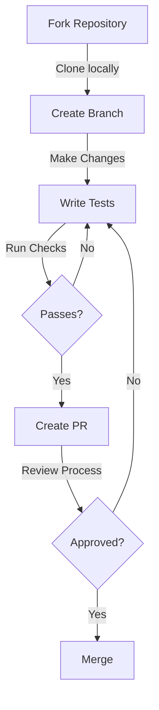

# Contributing to AI-Driven Lead Capture & SMS Platform

Thank you for your interest in contributing to our project! This document provides comprehensive guidelines for contributing to the AI-Driven Lead Capture & SMS Platform.

## Table of Contents
- [Introduction](#introduction)
- [Development Setup](#development-setup)
- [Code Standards](#code-standards)
- [Testing Requirements](#testing-requirements)
- [Pull Request Process](#pull-request-process)
- [Security Considerations](#security-considerations)
- [Documentation](#documentation)

## Introduction

### Project Overview
The AI-Driven Lead Capture & SMS Platform is a unified solution designed to automate and streamline lead management through intelligent SMS communication. We welcome contributions that help improve the platform's capabilities while maintaining high standards of code quality and security.

### Contribution Workflow


### Code of Conduct
All contributors are expected to adhere to our code of conduct, which promotes a respectful and inclusive environment for collaboration.

### Contact Information
- Project Maintainers: [maintainers@example.com](mailto:maintainers@example.com)
- Technical Lead: [techlead@example.com](mailto:techlead@example.com)

## Development Setup

### Prerequisites
1. Node.js 18.x LTS
   ```bash
   # Check Node.js version
   node --version
   
   # Install using nvm (recommended)
   nvm install 18
   nvm use 18
   ```

2. Package Manager
   ```bash
   # Using npm
   npm install
   
   # Using yarn
   yarn install
   ```

3. Environment Setup
   ```bash
   # Copy environment template
   cp .env.example .env.local
   
   # Configure required variables
   # - DATABASE_URL
   # - SMS_PROVIDER_API_KEY
   # - AI_SERVICE_KEY
   ```

### Local Development Workflow
1. Start development server:
   ```bash
   npm run dev
   # or
   yarn dev
   ```

2. Access development environment:
   - Web application: `http://localhost:3000`
   - API endpoints: `http://localhost:3000/api`

### Troubleshooting
- Database connection issues: Verify MongoDB connection string
- Build errors: Clear `.next` directory and node_modules
- Type errors: Run `tsc --noEmit` for detailed type checking

## Code Standards

### TypeScript Configuration
- Strict mode enabled
- Custom type definitions in `@types` directory
- No implicit any expressions
- Strict null checks enforced

### ESLint + Prettier Setup
```json
// .eslintrc.json
{
  "extends": [
    "airbnb",
    "airbnb-typescript",
    "prettier"
  ],
  "rules": {
    "import/prefer-default-export": "off",
    "react/require-default-props": "off"
  }
}
```

### Code Documentation
- JSDoc comments for all public functions
- Inline comments for complex logic
- Type definitions for all interfaces
- Component props documentation

Example:
```typescript
/**
 * Processes incoming SMS messages and generates AI responses
 * @param message - The incoming SMS message
 * @param context - Conversation context
 * @returns Promise<SMSResponse>
 */
async function processMessage(
  message: IncomingSMS,
  context: ConversationContext
): Promise<SMSResponse> {
  // Implementation
}
```

## Testing Requirements

### Coverage Requirements
- Minimum 80% code coverage
- 100% coverage for critical paths
- Integration tests for API endpoints
- E2E tests for critical flows

### Test Organization
```typescript
describe('MessageProcessor', () => {
  describe('processMessage', () => {
    it('should generate AI response for new conversation', async () => {
      // Test implementation
    });

    it('should handle error cases gracefully', async () => {
      // Test implementation
    });
  });
});
```

### Performance Testing
- Response time < 200ms for API endpoints
- Memory usage monitoring
- Load testing for concurrent users
- SMS throughput validation

## Pull Request Process

### Branch Naming
Format: `type/description`
Examples:
- `feature/ai-response-enhancement`
- `fix/sms-delivery-retry`
- `docs/api-documentation`

### Commit Messages
Format: `type(scope): description`
Examples:
- `feat(messaging): add retry mechanism for failed SMS`
- `fix(forms): resolve validation error in phone fields`
- `docs(api): update endpoint documentation`

### PR Requirements
1. Fill out PR template completely
2. Link related issues
3. Update documentation
4. Add/update tests
5. Pass CI/CD checks

### Review Process
1. Code review by 2 maintainers
2. Security review for sensitive changes
3. Documentation review
4. Performance impact assessment

## Security Considerations

### Security Guidelines
- Follow OWASP security practices
- Implement rate limiting
- Use proper input validation
- Encrypt sensitive data
- Follow least privilege principle

### Vulnerability Reporting
See [SECURITY.md](SECURITY.md) for:
- Reporting process
- Disclosure policy
- Security contacts
- Bug bounty information

## Documentation

### Requirements
1. API documentation updates
2. Architecture diagram changes
3. README updates
4. Changelog entries
5. Type definition updates

### Version History
We follow semantic versioning (MAJOR.MINOR.PATCH):
- MAJOR: Breaking changes
- MINOR: New features
- PATCH: Bug fixes

## License
This project is licensed under the MIT License - see [LICENSE](LICENSE) for details.