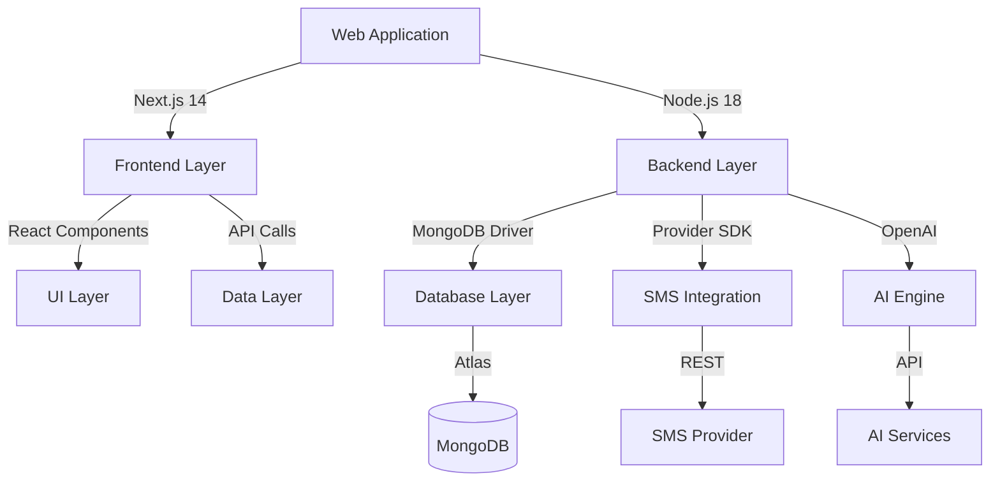

# AI-Driven Lead Capture & SMS Lead Nurturing Platform

[](github-actions-link)
[](version-link)
[](LICENSE)

A unified solution designed to automate and streamline lead management through intelligent SMS communication. The platform integrates form-based lead capture with AI-powered SMS nurturing capabilities, providing sales teams with automated yet supervisable lead communication tools.

## 🌟 Key Features

- **Smart Lead Capture Forms**: Customizable, embeddable forms with real-time validation
- **AI-Powered SMS Conversations**: Intelligent message handling with human takeover capability
- **Unified SMS Inbox**: Centralized message management interface
- **Provider-Agnostic Architecture**: Flexible SMS provider integration
- **Enterprise-Grade Security**: End-to-end encryption and compliance features
- **Real-Time Analytics**: Comprehensive conversion and performance tracking

## 🏗 System Architecture



## 🚀 Getting Started

### Prerequisites

- Node.js 18.x LTS
- MongoDB Atlas account
- SMS provider account
- OpenAI API key

### Installation

1. Clone the repository:
```bash
git clone https://github.com/{organization}/{repo}.git
cd {repo}
```

2. Install dependencies:
```bash
npm install
```

3. Configure environment variables:
```bash
cp .env.example .env.local
```

4. Set up required environment variables:
```
MONGODB_URI=your_mongodb_connection_string
SMS_PROVIDER_API_KEY=your_sms_api_key
OPENAI_API_KEY=your_openai_api_key
```

5. Start development server:
```bash
npm run dev
```

## 💻 Development

### Available Scripts

- `npm run dev` - Start development server
- `npm run build` - Build production bundle
- `npm run start` - Start production server
- `npm run test` - Run test suite
- `npm run lint` - Run code linting
- `npm run format` - Format code with Prettier

### Development Environment

- VS Code with recommended extensions
- ESLint + Prettier configuration
- TypeScript strict mode
- Jest testing framework

## 🌩 Deployment

### Vercel Deployment

1. Connect your GitHub repository to Vercel
2. Configure environment variables in Vercel dashboard
3. Deploy with automatic CI/CD pipeline

### MongoDB Atlas Setup

1. Create MongoDB Atlas cluster
2. Configure network access and database user
3. Set up database indexes and monitoring

## 📚 Documentation

### API Documentation

Comprehensive API documentation is available at `/api/docs` when running the development server.

### Component Documentation

UI component documentation and usage examples are available in the `/docs` directory.

## 🔒 Security

Please review our [Security Policy](SECURITY.md) for:
- Vulnerability reporting
- Security best practices
- Data protection guidelines

## 🤝 Contributing

We welcome contributions! Please see our [Contributing Guidelines](CONTRIBUTING.md) for:
- Development workflow
- Code style guidelines
- Pull request process
- Code review requirements

## 📄 License

This project is licensed under the MIT License - see the [LICENSE](LICENSE) file for details.

## 🔍 Troubleshooting

Common issues and solutions are documented in our [Wiki](https://github.com/{organization}/{repo}/wiki).

## 📊 System Status

View real-time system status and incident reports at our [Status Page](https://status.{domain}).

## 📞 Support

- Technical Issues: Create a GitHub issue
- Security Concerns: security@{domain}
- General Inquiries: support@{domain}

---

Built with ❤️ by {organization}