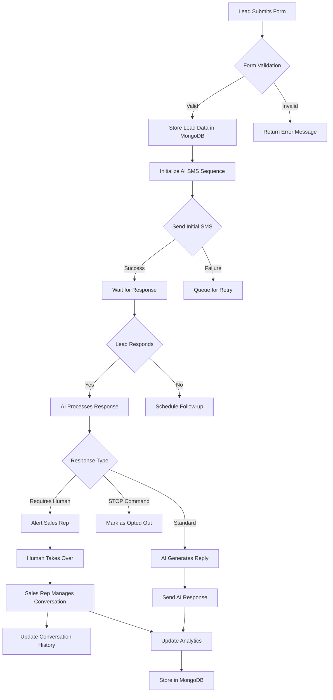
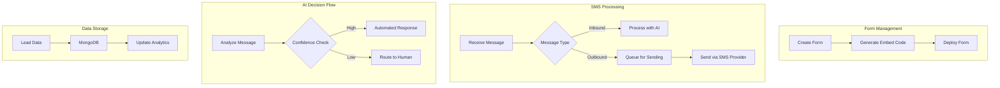
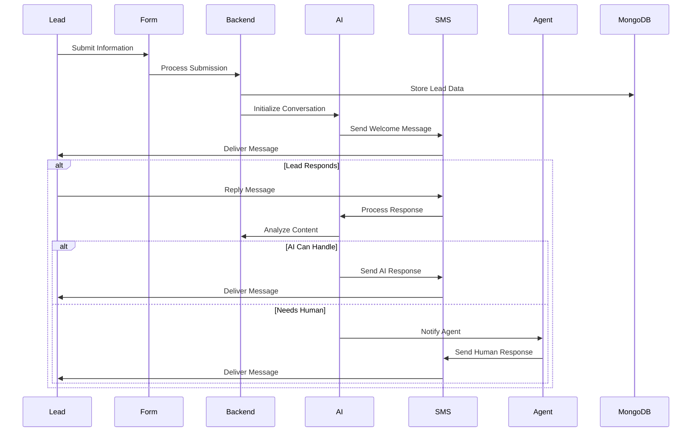
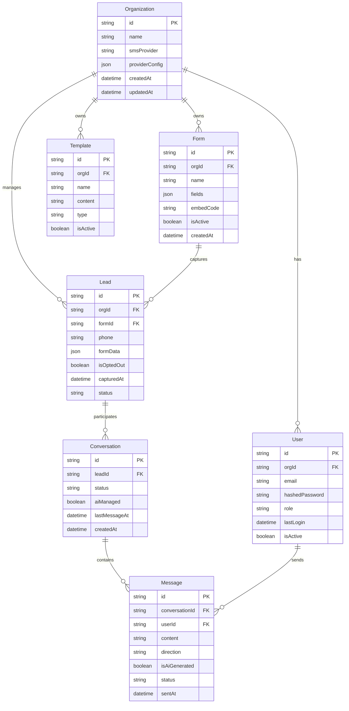
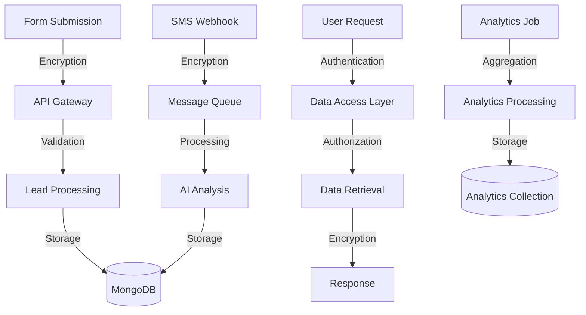
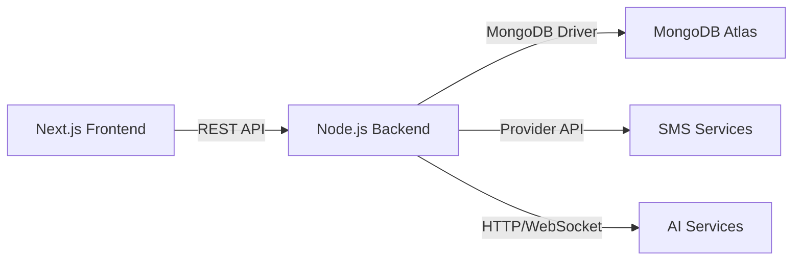
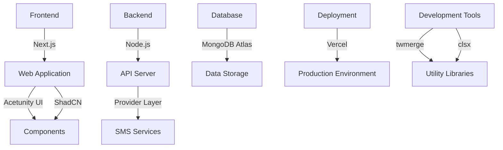

# Product Requirements Document (PRD)

# 1. INTRODUCTION

## 1.1 Purpose

This Software Requirements Specification (SRS) document provides a comprehensive description of the AI-Driven Lead Capture & SMS Lead Nurturing Platform. It details the functional and non-functional requirements for developers, project managers, and stakeholders involved in the development process. The document serves as the primary reference for technical implementation and validation of the delivered system.

## 1.2 Scope

The AI-Driven Lead Capture & SMS Lead Nurturing Platform is a unified solution that automates and streamlines the lead capture and follow-up process through intelligent SMS communication. The system encompasses:

- Lead capture form creation and embedding capabilities
- AI-powered SMS conversation management
- Human-AI collaborative messaging interface
- Analytics and engagement tracking
- Provider-agnostic SMS integration

Key benefits include:

- Reduced manual intervention in lead nurturing
- Consistent and timely follow-up communication
- Seamless transition between AI and human agents
- Centralized lead management
- Scalable messaging architecture

The platform will be built using:

- Next.js for frontend development
- Node.js for backend services
- Vercel for deployment
- MongoDB for data storage
- Acetunity UI and ShadCN for component library
- SMS provider integration layer

Out of scope:

- Custom SMS provider implementations
- Multi-channel communication (focus on SMS only)
- Complex deployment architectures beyond Vercel
- Custom AI model training

IMPORTANT NOTE: This is an MVP, I want the build and deploy process to be simple!! Very simple! I want to just set up a database using some db provider, and then upload this repo to Vercel, and bang it is live. 

# 2. PRODUCT DESCRIPTION

## 2.1 Product Perspective

The AI-Driven Lead Capture & SMS Lead Nurturing Platform operates as a standalone SaaS solution deployed on Vercel's infrastructure. The system integrates with external SMS providers through a provider-agnostic layer and utilizes MongoDB for data persistence. The platform functions within the following context:

- Operates as a web-based application accessible through modern browsers
- Interfaces with third-party SMS providers for message delivery
- Integrates with websites via embeddable form components
- Connects to MongoDB for data storage and retrieval
- Utilizes AI services for natural language processing

## 2.2 Product Functions

The platform provides the following core functions:

1. Lead Capture Management

   - Form creation and customization
   - Embeddable form generation
   - Lead data collection and storage

2. AI-Powered SMS Communication

   - Automated conversation initiation
   - Natural language message processing
   - Intelligent response generation
   - Conversation context maintenance

3. Human-AI Collaboration

   - Unified SMS inbox
   - Real-time conversation monitoring
   - Seamless AI-to-human handoff
   - Conversation history tracking

4. Analytics and Reporting

   - Engagement metrics tracking
   - Conversion analytics
   - Performance reporting
   - Lead quality assessment

## 2.3 User Characteristics

Primary users of the system include:

1. Sales Representatives

   - Technical proficiency: Moderate
   - Usage frequency: Daily
   - Primary needs: Lead management, conversation monitoring
   - Key activities: Message review, human takeover

2. Sales Managers

   - Technical proficiency: Moderate to High
   - Usage frequency: Weekly
   - Primary needs: Performance oversight, strategy adjustment
   - Key activities: Analytics review, template management

3. System Administrators

   - Technical proficiency: High
   - Usage frequency: Monthly
   - Primary needs: System configuration, user management
   - Key activities: Integration setup, permission management

## 2.4 Constraints

1. Technical Constraints

   - Limited to Vercel deployment infrastructure
   - MongoDB as primary database
   - Next.js frontend framework
   - Node.js backend runtime
   - Acetunity UI and ShadCN component libraries

2. Regulatory Constraints

   - SMS marketing compliance requirements
   - Opt-out handling (STOP command)
   - Data privacy regulations
   - Message frequency limitations

3. Operational Constraints

   - Single deployment environment
   - Provider-agnostic SMS integration
   - Real-time processing requirements
   - Browser compatibility requirements

## 2.5 Assumptions and Dependencies

1. Assumptions

   - Users have stable internet connectivity
   - Modern browser availability
   - Basic technical literacy of users
   - SMS provider API availability
   - MongoDB hosting availability

2. Dependencies

   - SMS provider services
   - MongoDB database service
   - Vercel platform availability
   - AI service availability
   - Third-party UI component libraries
   - Node.js runtime environment

# 3. PROCESS FLOWCHART

# 4. FUNCTIONAL REQUIREMENTS

## 4.1 Lead Capture Form Management

### ID: F-001

### Description

System for creating, customizing, and embedding lead capture forms on websites.

### Priority: High

### Requirements

| ID | Requirement | Details |
| --- | --- | --- |
| F-001-1 | Form Builder Interface | Visual drag-and-drop interface using Acetunity UI and ShadCN components |
| F-001-2 | Form Embedding | Generate embeddable code snippet for website integration |
| F-001-3 | Form Validation | Client and server-side validation of submitted data |
| F-001-4 | Custom Fields | Support for text, email, phone, and custom field types |
| F-001-5 | Form Templates | Pre-built templates for quick form creation |

## 4.2 SMS Communication Engine

### ID: F-002

### Description

Provider-agnostic SMS messaging system with queuing and delivery management.

### Priority: High

### Requirements

| ID | Requirement | Details |
| --- | --- | --- |
| F-002-1 | Provider Integration | Abstract SMS provider layer supporting multiple services |
| F-002-2 | Message Queuing | Reliable message queue system using Node.js |
| F-002-3 | Delivery Tracking | Message delivery status monitoring and updates |
| F-002-4 | Opt-out Handling | Automatic processing of STOP commands |
| F-002-5 | Rate Limiting | Compliance with SMS provider rate limits |

## 4.3 AI Conversation Management

### ID: F-003

### Description

AI-powered system for automated SMS conversation handling and response generation.

### Priority: High

### Requirements

| ID | Requirement | Details |
| --- | --- | --- |
| F-003-1 | Response Generation | AI-powered message composition and response |
| F-003-2 | Context Awareness | Maintain conversation context and history |
| F-003-3 | Intent Recognition | Identify user intent and appropriate responses |
| F-003-4 | Handoff Detection | Identify scenarios requiring human intervention |
| F-003-5 | Template Integration | Use and learn from predefined response templates |

## 4.4 Unified Inbox Interface

### ID: F-004

### Description

Centralized dashboard for managing all SMS conversations.

### Priority: Medium

### Requirements

| ID | Requirement | Details |
| --- | --- | --- |
| F-004-1 | Conversation List | Real-time list of all SMS threads |
| F-004-2 | Thread View | Detailed conversation history display |
| F-004-3 | Search & Filter | Advanced search and filtering capabilities |
| F-004-4 | Status Indicators | Visual indicators for AI/human managed threads |
| F-004-5 | Quick Actions | Rapid response and takeover actions |

## 4.5 Analytics and Reporting

### ID: F-005

### Description

Comprehensive analytics system for tracking engagement and performance.

### Priority: Medium

### Requirements

| ID | Requirement | Details |
| --- | --- | --- |
| F-005-1 | Engagement Metrics | Track message open and response rates |
| F-005-2 | Conversion Tracking | Monitor lead progression and conversions |
| F-005-3 | AI Performance | Track AI response effectiveness |
| F-005-4 | Custom Reports | Generate customizable performance reports |
| F-005-5 | Data Export | Export analytics data in standard formats |

## 4.6 System Administration

### ID: F-006

### Description

Administrative functions for system configuration and management.

### Priority: Low

### Requirements

| ID | Requirement | Details |
| --- | --- | --- |
| F-006-1 | User Management | Create and manage user accounts |
| F-006-2 | Role Management | Define and assign user roles and permissions |
| F-006-3 | SMS Configuration | Configure SMS provider settings |
| F-006-4 | AI Settings | Adjust AI behavior and response parameters |
| F-006-5 | System Monitoring | Monitor system health and performance |

# 5. NON-FUNCTIONAL REQUIREMENTS

## 5.1 Performance Requirements

| Requirement | Description | Target Metric |
| --- | --- | --- |
| Response Time | Maximum time for form submission processing | \< 2 seconds |
| SMS Processing | Time from receipt to AI response generation | \< 5 seconds |
| Page Load Time | Initial dashboard load time | \< 3 seconds |
| Database Queries | Maximum query execution time | \< 500ms |
| Concurrent Users | Supported simultaneous active users | 1000+ |
| Message Queue | SMS delivery throughput | 100/second |
| Real-time Updates | Inbox refresh latency | \< 1 second |

## 5.2 Safety Requirements

| Requirement | Description |
| --- | --- |
| Data Backup | Automated daily backups of MongoDB data with 30-day retention |
| Failure Recovery | Automatic failover for message queue system |
| Error Logging | Comprehensive error tracking and notification system |
| Message History | Immutable audit trail of all SMS communications |
| State Recovery | Automatic conversation state preservation and recovery |
| Rate Protection | SMS rate limiting to prevent accidental spam |

## 5.3 Security Requirements

| Requirement | Description |
| --- | --- |
| Authentication | JWT-based authentication with secure session management |
| Authorization | Role-based access control (RBAC) for system features |
| Data Encryption | At-rest encryption for MongoDB data |
| Communication Security | TLS 1.3 for all API communications |
| Password Security | Bcrypt hashing with minimum complexity requirements |
| API Security | Rate limiting and API key authentication |
| SMS Verification | Two-factor authentication support via SMS |

## 5.4 Quality Requirements

### 5.4.1 Availability

- System uptime: 99.9%
- Planned maintenance windows: \< 4 hours/month
- Recovery Time Objective (RTO): \< 1 hour
- Recovery Point Objective (RPO): \< 5 minutes

### 5.4.2 Maintainability

- Modular architecture with clear separation of concerns
- Comprehensive API documentation
- Automated deployment pipeline via Vercel
- Standardized logging and monitoring

### 5.4.3 Usability

- Mobile-responsive design
- Maximum 3 clicks to reach any feature
- Consistent UI using Acetunity and ShadCN components
- Intuitive form builder interface
- Clear error messages and user feedback

### 5.4.4 Scalability

- Horizontal scaling via Vercel's infrastructure
- MongoDB Atlas scaling capabilities
- Message queue auto-scaling
- Stateless application architecture

### 5.4.5 Reliability

- Automated failover mechanisms
- Message delivery retry logic
- Graceful degradation of AI features
- Transaction consistency in MongoDB operations

## 5.5 Compliance Requirements

| Requirement | Description |
| --- | --- |
| SMS Regulations | TCPA compliance for SMS marketing |
| Opt-out Handling | Immediate processing of STOP commands |
| Data Privacy | GDPR and CCPA compliance for data handling |
| Data Retention | Configurable data retention policies |
| Audit Trail | Complete logging of system access and changes |
| Message Disclosure | Required marketing message disclosures |
| Accessibility | WCAG 2.1 Level AA compliance |

# 6. DATA REQUIREMENTS

## 6.1 Data Models

## 6.2 Data Storage

### 6.2.1 Primary Storage

- MongoDB Atlas as primary database
- Collections organized by organization with sharding
- Indexes on frequently queried fields:
  - Lead phone numbers
  - Conversation status
  - Message timestamps
  - Form identifiers

### 6.2.2 Data Retention

| Data Type | Retention Period | Archive Policy |
| --- | --- | --- |
| Lead Data | 3 years | Archive to cold storage |
| Messages | 2 years | Archive to cold storage |
| Form Submissions | 1 year | Delete |
| System Logs | 90 days | Delete |
| Analytics Data | 1 year | Aggregate and archive |

### 6.2.3 Backup Strategy

- Daily automated backups via MongoDB Atlas
- Point-in-time recovery enabled
- 30-day backup retention
- Cross-region backup replication
- Monthly backup verification tests

## 6.3 Data Processing

### 6.3.1 Data Security

| Security Layer | Implementation |
| --- | --- |
| Transport | TLS 1.3 for all API communications |
| Storage | MongoDB Atlas encryption at rest |
| Field Level | Encryption for sensitive fields |
| Access Control | Role-based document level security |
| API Security | JWT authentication and rate limiting |

### 6.3.2 Data Validation

- Schema validation on MongoDB collections
- API-level input validation
- Phone number formatting and validation
- Form field type enforcement
- Message content sanitization

### 6.3.3 Data Transformation

- Phone number standardization
- Message template variable substitution
- Analytics data aggregation
- Export format conversion
- Lead data normalization

### 6.3.4 Data Integration

- SMS provider webhook processing
- Form submission handling
- Analytics data collection
- Backup system integration
- Monitoring system integration

# 7. EXTERNAL INTERFACES

## 7.1 User Interfaces

### 7.1.1 Web Application Interface

| Interface | Description | Components |
| --- | --- | --- |
| Form Builder | Visual drag-and-drop interface | - Acetunity UI form elements - ShadCN component library - Live preview panel - Field configuration sidebar |
| SMS Inbox | Unified conversation management | - Real-time message list - Thread view panel - Quick action buttons - Status indicators |
| Analytics Dashboard | Performance metrics display | - Data visualization charts - Filterable data tables - Export controls - Date range selectors |
| Settings Panel | System configuration interface | - Form configuration - SMS provider setup - User management - AI behavior controls |

### 7.1.2 Responsive Design Requirements

| Breakpoint | Layout Behavior |
| --- | --- |
| Desktop (\>1024px) | Full feature set with multi-column layout |
| Tablet (768-1024px) | Responsive grid with preserved functionality |
| Mobile (\<768px) | Single column layout with collapsible panels |

## 7.2 Software Interfaces

### 7.2.1 External Service Integration

| Service Type | Interface Method | Data Format |
| --- | --- | --- |
| SMS Providers | RESTful API | JSON/HTTP |
| MongoDB Atlas | MongoDB Driver | BSON |
| AI Services | HTTP/WebSocket | JSON |
| Analytics Services | RESTful API | JSON |

### 7.2.2 API Specifications

## 7.3 Communication Interfaces

### 7.3.1 Network Protocols

| Protocol | Usage | Port |
| --- | --- | --- |
| HTTPS | Web Application | 443 |
| WSS | Real-time Updates | 443 |
| TLS 1.3 | Data Encryption | - |

### 7.3.2 Data Exchange Formats

| Format | Usage |
| --- | --- |
| JSON | API Responses |
| BSON | MongoDB Storage |
| JWT | Authentication |
| Base64 | File Encoding |

### 7.3.3 Webhook Specifications

| Webhook Type | Format | Required Headers |
| --- | --- | --- |
| SMS Provider Callbacks | JSON | - Authorization - Content-Type - Webhook-ID |
| Form Submissions | JSON | - Form-ID - Organization-ID |
| System Notifications | JSON | - Event-Type - Timestamp |

# 8. APPENDICES

## 8.1 GLOSSARY

| Term | Definition |
| --- | --- |
| Lead Capture | Process of collecting potential customer information through web forms |
| Lead Nurturing | Process of developing relationships with buyers at every stage of the sales funnel |
| Provider-agnostic | System designed to work with multiple SMS service providers without dependency on any specific one |
| Handoff | Process of transitioning conversation management from AI to human agent |
| Thread | Complete sequence of SMS messages between the system and a lead |
| Opt-out | When a recipient requests to stop receiving SMS messages |
| Cold Storage | Long-term data storage solution for infrequently accessed data |
| Webhook | HTTP callback that occurs when something happens in a system |

## 8.2 ACRONYMS

| Acronym | Expansion |
| --- | --- |
| AI | Artificial Intelligence |
| API | Application Programming Interface |
| BSON | Binary JSON |
| CCPA | California Consumer Privacy Act |
| GDPR | General Data Protection Regulation |
| JWT | JSON Web Token |
| PRD | Product Requirements Document |
| RBAC | Role-Based Access Control |
| RPO | Recovery Point Objective |
| RTO | Recovery Time Objective |
| SMS | Short Message Service |
| SRS | Software Requirements Specification |
| TCPA | Telephone Consumer Protection Act |
| TLS | Transport Layer Security |
| UI | User Interface |
| WCAG | Web Content Accessibility Guidelines |
| WSS | WebSocket Secure |

## 8.3 ADDITIONAL REFERENCES

| Reference | Description | URL |
| --- | --- | --- |
| Next.js Documentation | Official Next.js framework documentation | https://nextjs.org/docs |
| MongoDB Atlas | MongoDB cloud database documentation | https://docs.atlas.mongodb.com |
| Vercel Documentation | Vercel deployment platform documentation | https://vercel.com/docs |
| Acetunity UI | Component library documentation | \[Link to Acetunity docs\] |
| ShadCN | UI component documentation | https://ui.shadcn.com |
| TCPA Compliance | SMS marketing compliance guidelines | https://www.fcc.gov/tcpa |

## 8.4 TECHNOLOGY STACK SUMMARY

