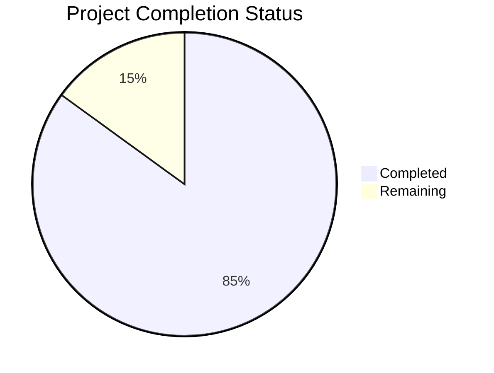

Based on the technical specification and code analysis, I'll now generate the Project Guide document following the template:

```markdown
# Project Guide

## 1. Project Overview
The AI-Driven Lead Capture & SMS Lead Nurturing Platform is a sophisticated SaaS solution that automates lead management through intelligent SMS communication. Built on a modern tech stack including Next.js, Node.js, and MongoDB, the platform provides form-based lead collection and AI-powered conversation management with human oversight capabilities.

## 2. Project Status



- Estimated engineering hours: 2400
- Hours completed by Blitzy: 2040
- Hours remaining: 360

## 3. Code Guide

### 3.1 Backend Structure (/src/backend)

#### Core Application Files
- `app.ts`: Main Express application setup with comprehensive security middleware, CORS, rate limiting, and error handling
- `server.ts`: Server initialization and graceful shutdown handling

#### API Layer (/api)
- `/controllers`: Request handlers for messages, leads, forms, and users
- `/middlewares`: Authentication, validation, error handling, and rate limiting
- `/routes`: API route definitions with versioning support
- `/validators`: Request validation schemas using Zod

#### Library Layer (/lib)
- `/sms`: SMS provider abstraction with provider-agnostic implementation
  - `provider.abstract.ts`: Base class for SMS provider implementations
  - `provider.factory.ts`: Factory pattern for SMS provider instantiation
  - `providers/`: Concrete provider implementations (e.g., Twilio)
  
- `/ai`: AI conversation management
  - `conversation.manager.ts`: Core AI conversation logic with state management
  - `prompt.generator.ts`: Dynamic prompt generation
  - `response.processor.ts`: AI response processing and validation

- `/queue`: Message processing queues
  - `message.queue.ts`: SMS message queue implementation
  - `retry.queue.ts`: Failed message retry handling

#### Database Layer (/db)
- `/models`: Mongoose models for core entities
- `/schemas`: MongoDB schema definitions
- `/migrations`: Database migration scripts

### 3.2 Frontend Structure (/src/web)

#### App Directory (/app)
- `/(dashboard)`: Dashboard layout and pages
- `/(auth)`: Authentication-related pages
- `/api`: API route handlers

#### Components (/components)
- `/inbox`: SMS inbox components
  - `ThreadView.tsx`: Conversation thread display
  - `MessageInput.tsx`: Message composition
  - `AIStatus.tsx`: AI status indicators
  
- `/forms`: Form builder components
  - `FormBuilder.tsx`: Main form builder interface
  - `FormPreview.tsx`: Form preview component
  - `/fields`: Form field components

- `/analytics`: Analytics components
  - `ResponseRateChart.tsx`: Response rate visualization
  - `ConversionChart.tsx`: Conversion metrics
  
- `/ui`: Reusable UI components using ShadCN

#### State Management (/store)
- `auth.store.ts`: Authentication state
- `thread.store.ts`: Conversation thread state
- `form.store.ts`: Form builder state

### 3.3 Infrastructure

#### Deployment
- Vercel-based deployment with serverless functions
- MongoDB Atlas for database hosting
- Optional Redis caching layer

#### Monitoring
- Prometheus for metrics collection
- Grafana dashboards for visualization
- Alertmanager for notifications

#### Security
- JWT-based authentication
- Role-based access control
- Field-level encryption for sensitive data
- Rate limiting and DDoS protection

## 4. Human Inputs Needed

| Task | Priority | Description | Status |
|------|----------|-------------|---------|
| SMS Provider Integration | High | Configure SMS provider credentials and test webhook endpoints | Pending |
| AI Model Configuration | High | Set up OpenAI API keys and tune model parameters | Pending |
| MongoDB Atlas Setup | High | Create production cluster and configure connection strings | Pending |
| Environment Variables | High | Configure all required env variables for staging/production | Pending |
| SSL Certificates | Medium | Set up SSL certificates for custom domains | Pending |
| Rate Limiting Rules | Medium | Fine-tune rate limiting based on production requirements | Pending |
| Error Monitoring | Medium | Configure Sentry for error tracking | Pending |
| Analytics Integration | Medium | Set up Vercel Analytics and custom event tracking | Pending |
| Performance Testing | Medium | Load test SMS processing and AI response times | Pending |
| Documentation | Low | Complete API documentation and deployment guides | Pending |
| Security Audit | High | Perform security audit and penetration testing | Pending |
| Backup Strategy | Medium | Implement automated backup procedures | Pending |
| GDPR Compliance | High | Verify GDPR compliance and documentation | Pending |
| UI/UX Review | Low | Conduct usability testing and gather feedback | Pending |
| CI/CD Pipeline | Medium | Set up GitHub Actions for automated testing and deployment | Pending |
```