# Technical Specifications

# 1. INTRODUCTION

## 1.1 EXECUTIVE SUMMARY

The AI-Driven Lead Capture & SMS Lead Nurturing Platform is a unified solution designed to automate and streamline lead management through intelligent SMS communication. The system addresses the critical business challenge of disconnected lead capture and follow-up processes by providing an integrated platform for form-based lead collection and AI-powered SMS nurturing. Primary stakeholders include sales teams and real estate agents who require automated yet supervisable lead communication capabilities. The platform delivers value through reduced manual intervention, consistent follow-up, and intelligent conversation management while maintaining human oversight capabilities.

## 1.2 SYSTEM OVERVIEW

### Project Context

| Aspect | Details |
|--------|----------|
| Market Position | Unified lead capture and nurturing solution for sales teams |
| Current Limitations | Disconnected form tools and SMS systems, manual follow-up processes |
| Enterprise Integration | Standalone SaaS solution with SMS provider integration capabilities |

### High-Level Description

The system implements a provider-agnostic SMS architecture deployed on Vercel's infrastructure, utilizing:

- Next.js frontend with Acetunity UI and ShadCN components
- Node.js backend services
- MongoDB for data persistence
- AI-powered conversation management
- Real-time messaging capabilities

### Success Criteria

| Category | Metrics |
|----------|----------|
| Performance | - Message processing < 5 seconds<br>- Form submission handling < 2 seconds<br>- 99.9% system uptime |
| Business | - Increased lead response rates<br>- Reduced manual follow-up time<br>- Higher conversion rates |
| Technical | - Successful Vercel deployment<br>- MongoDB integration<br>- SMS provider compatibility |

## 1.3 SCOPE

### In-Scope Elements

| Category | Components |
|----------|------------|
| Core Features | - Lead capture form creation and embedding<br>- AI-powered SMS conversation management<br>- Human takeover capabilities<br>- Unified SMS inbox<br>- Analytics and reporting |
| Implementation | - Vercel-based deployment<br>- MongoDB database integration<br>- SMS provider abstraction layer<br>- Web-based administrative interface |
| User Groups | - Sales representatives<br>- Sales managers<br>- System administrators |

### Out-of-Scope Elements

| Category | Exclusions |
|----------|------------|
| Features | - Multi-channel communication beyond SMS<br>- Custom SMS provider implementations<br>- Complex AI model training<br>- Advanced workflow automation |
| Technical | - Custom deployment architectures<br>- On-premise installations<br>- Legacy system migrations<br>- Custom infrastructure requirements |
| Integration | - CRM system integration<br>- Marketing automation platforms<br>- Custom analytics tools<br>- Third-party lead sources |

# 2. SYSTEM ARCHITECTURE

## 2.1 High-Level Architecture

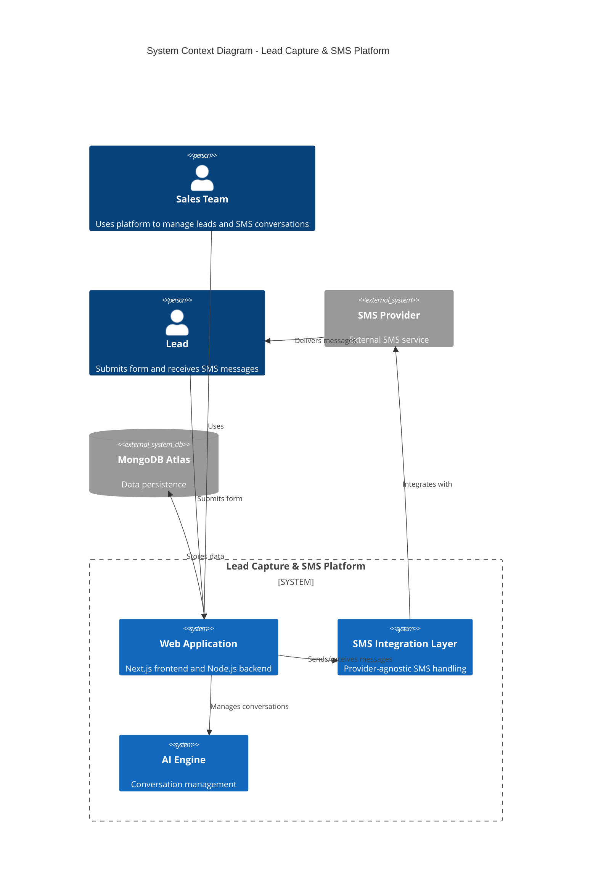

## 2.2 Component Details

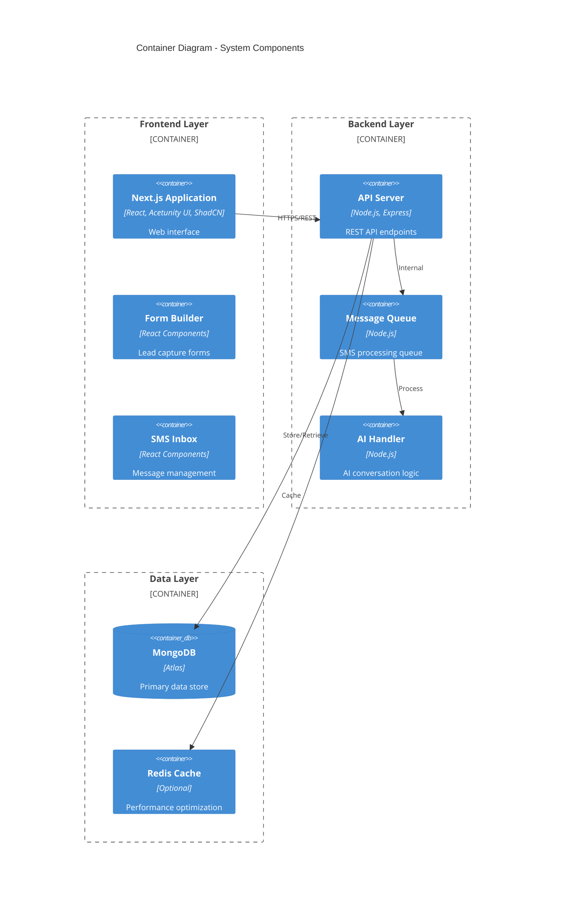

## 2.3 Technical Decisions

### Architecture Style
- Monolithic application deployed on Vercel
- Modular internal structure for maintainability
- Provider-agnostic SMS integration layer

| Component | Technology Choice | Justification |
|-----------|------------------|---------------|
| Frontend | Next.js | Server-side rendering, simplified deployment |
| Backend | Node.js | JavaScript ecosystem compatibility |
| Database | MongoDB | Schema flexibility, cloud hosting |
| SMS Layer | Custom Abstraction | Provider independence |
| Cache | Redis (Optional) | Performance optimization |

## 2.4 Cross-Cutting Concerns

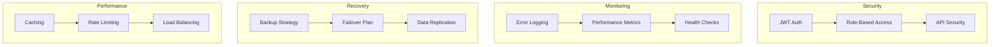

## 2.5 Deployment Architecture

```mermaid
C4Deployment
    title Deployment Diagram

    Deployment_Node(browser, "Web Browser", "Chrome, Firefox, Safari") {
        Container(spa, "Single Page Application", "Next.js")
    }

    Deployment_Node(vercel, "Vercel Platform", "Production Environment") {
        Container(frontend, "Frontend", "Next.js SSR")
        Container(backend, "Backend", "Node.js API")
    }

    Deployment_Node(atlas, "MongoDB Atlas", "Database Cluster") {
        ContainerDb(db, "MongoDB", "Primary Database")
    }

    Deployment_Node(sms, "SMS Provider", "External Service") {
        Container(smsapi, "SMS API", "Provider Service")
    }

    Rel(browser, vercel, "HTTPS")
    Rel(vercel, atlas, "MongoDB Protocol")
    Rel(vercel, sms, "HTTPS/REST")
```

## 2.6 Data Flow Architecture

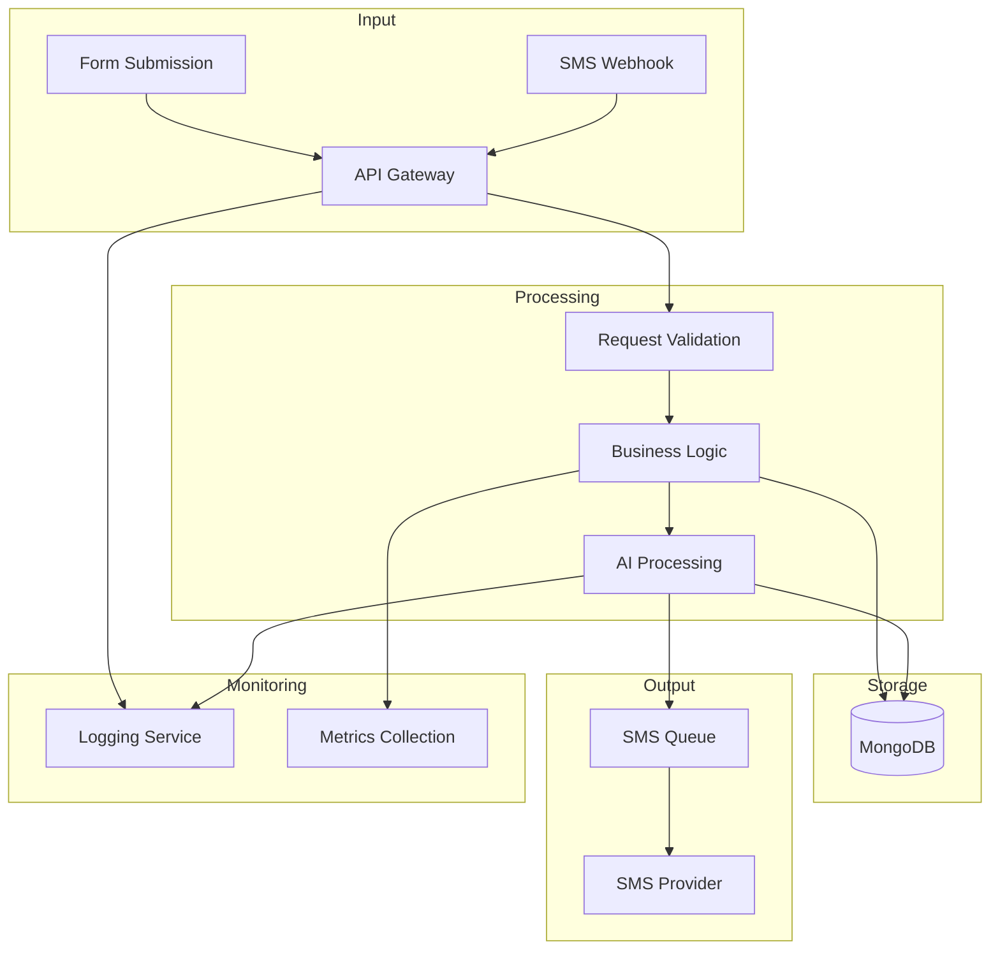

## 2.7 Component Communication

| From | To | Protocol | Pattern |
|------|-----|----------|----------|
| Frontend | Backend | HTTPS/REST | Request-Response |
| Backend | SMS Provider | HTTPS/REST | Async with retry |
| Backend | MongoDB | MongoDB Protocol | Direct connection |
| SMS Provider | Backend | Webhook | Event-driven |
| AI Engine | Backend | Internal | Synchronous |

## 2.8 Scaling Considerations

- Horizontal scaling via Vercel's infrastructure
- MongoDB Atlas auto-scaling
- Stateless application design
- Caching layer for performance optimization
- Message queue for SMS processing

## 2.9 Security Architecture

```mermaid
flowchart TD
    subgraph Security_Layers
        A[TLS Encryption] --> B[JWT Authentication]
        B --> C[Role-Based Access]
        C --> D[API Rate Limiting]
        D --> E[Data Encryption]
    end

    subgraph Access_Control
        F[User Authentication] --> G[Session Management]
        G --> H[Permission Validation]
    end

    subgraph Data_Protection
        I[Input Validation] --> J[SQL Injection Prevention]
        J --> K[XSS Protection]
    end
```

# 3. SYSTEM COMPONENTS ARCHITECTURE

## 3.1 USER INTERFACE DESIGN

### Design Specifications

| Aspect | Requirement |
|--------|-------------|
| Design System | Acetunity UI + ShadCN components |
| Accessibility | WCAG 2.1 Level AA |
| Color Modes | Light and dark theme support |
| Responsiveness | Mobile-first, fluid breakpoints |
| Browsers | Chrome 90+, Firefox 88+, Safari 14+, Edge 90+ |
| Language | English only for MVP |

### Interface Elements

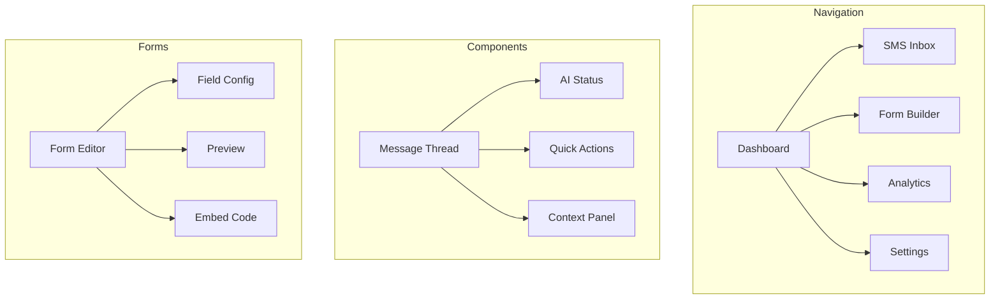

### Critical User Flows

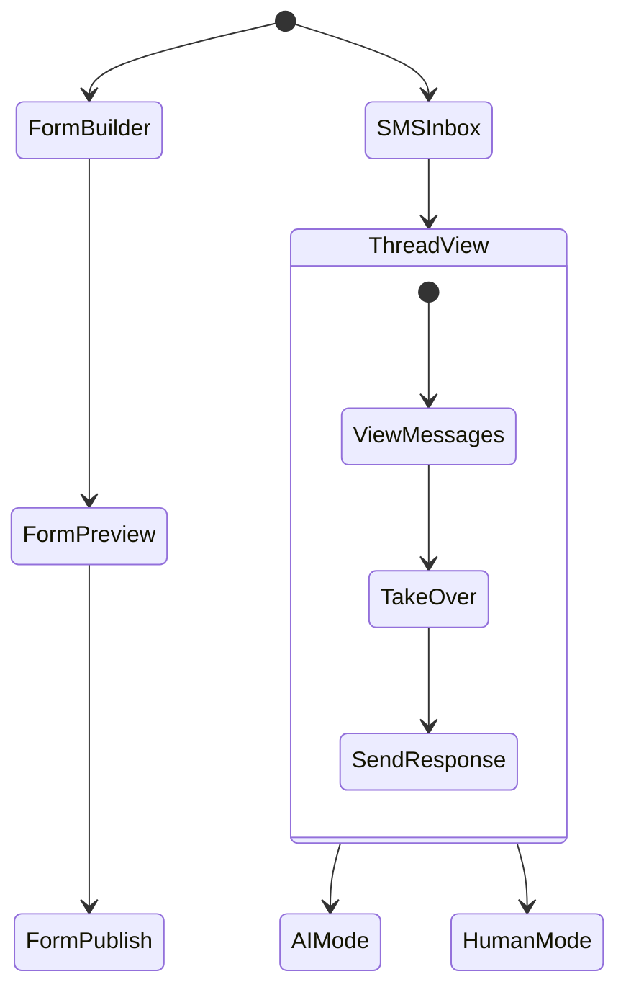

## 3.2 DATABASE DESIGN

### Schema Design

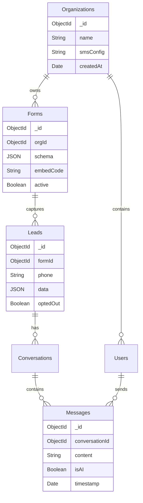

### Data Management Strategy

| Aspect | Implementation |
|--------|---------------|
| Migrations | MongoDB native migrations |
| Versioning | Document versioning with timestamps |
| Retention | 12-month rolling window for messages |
| Archival | Cold storage after 12 months |
| Backups | Daily automated MongoDB Atlas backups |
| Encryption | Field-level encryption for PII |

## 3.3 API DESIGN

### API Architecture

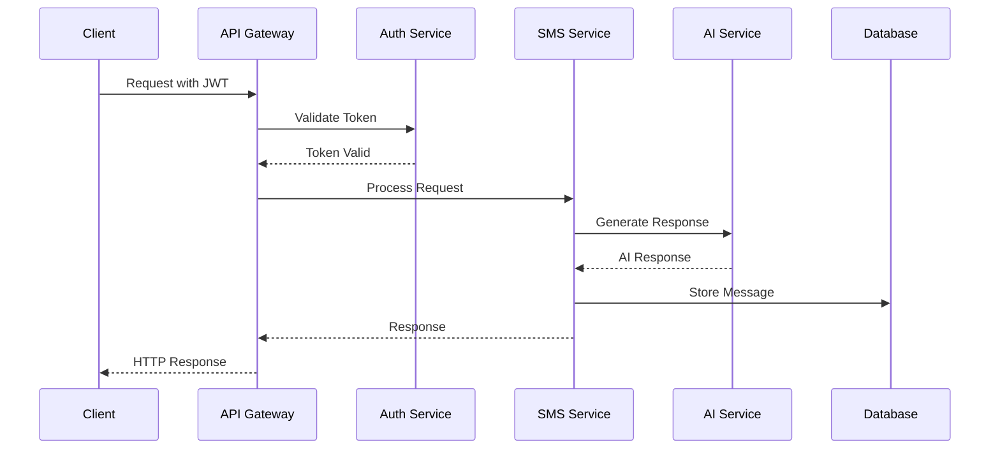

### Interface Specifications

| Endpoint | Method | Purpose | Auth |
|----------|--------|---------|------|
| /api/forms | POST | Create form | JWT |
| /api/leads | POST | Submit lead | Public |
| /api/messages | GET | Fetch threads | JWT |
| /api/messages/send | POST | Send message | JWT |
| /api/conversations/{id} | GET | Get thread | JWT |
| /api/webhooks/sms | POST | SMS webhook | API Key |

### Integration Requirements

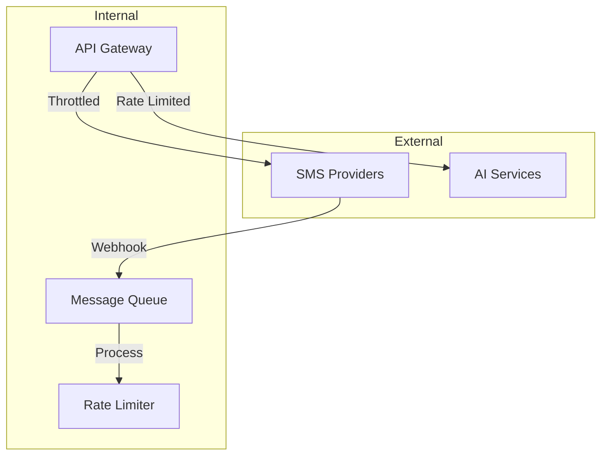

| Integration | Method | Rate Limit |
|-------------|--------|------------|
| SMS Provider | REST API | 100 req/min |
| AI Service | WebSocket | 50 req/min |
| Webhooks | HTTP POST | 200 req/min |
| Database | MongoDB Driver | N/A |

# 4. TECHNOLOGY STACK

## 4.1 PROGRAMMING LANGUAGES

| Platform | Language | Version | Justification |
|----------|----------|---------|---------------|
| Frontend | TypeScript | 5.0+ | Type safety, enhanced developer experience |
| Backend | Node.js | 18.x LTS | JavaScript ecosystem compatibility, Vercel optimization |
| Build Tools | JavaScript | ES2022 | Native build script support |

## 4.2 FRAMEWORKS & LIBRARIES

### Core Frameworks

| Component | Framework | Version | Purpose |
|-----------|-----------|---------|----------|
| Frontend | Next.js | 14.x | SSR, routing, API routes |
| UI Components | Acetunity UI | Latest | Consistent design system |
| Component Library | ShadCN | Latest | Accessible, customizable components |
| State Management | React Context | 18.x | Simple global state handling |

### Supporting Libraries

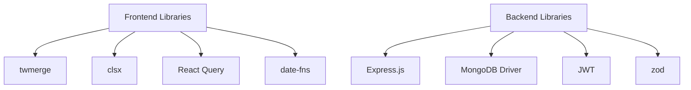

## 4.3 DATABASES & STORAGE

### Primary Database

| Type | Technology | Purpose |
|------|------------|----------|
| Document Store | MongoDB Atlas | Primary data persistence |
| Cache | Redis (Optional) | Performance optimization |

### Data Model

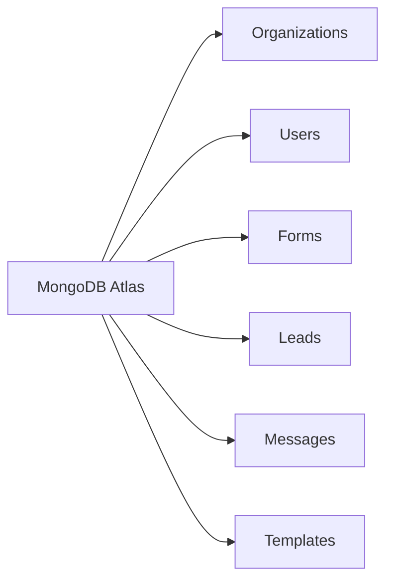

## 4.4 THIRD-PARTY SERVICES

| Service Type | Provider | Integration Method |
|--------------|----------|-------------------|
| SMS Gateway | Provider Agnostic | REST API |
| AI Services | OpenAI/Similar | HTTP API |
| Monitoring | Vercel Analytics | Built-in |
| Error Tracking | Sentry | SDK |

## 4.5 DEVELOPMENT & DEPLOYMENT

### Development Environment

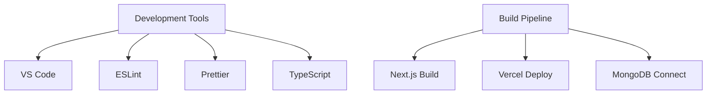

### Deployment Architecture

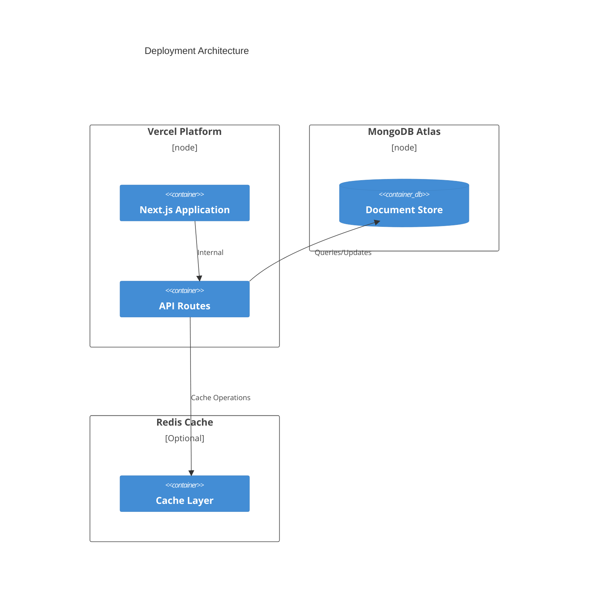

### Build Requirements

| Component | Tool | Configuration |
|-----------|------|---------------|
| Package Management | npm/yarn | Lock file versioning |
| Type Checking | TypeScript | Strict mode |
| Code Quality | ESLint + Prettier | Airbnb preset |
| Build Process | Next.js | Production optimization |

This technology stack prioritizes simplicity and ease of deployment while maintaining modern development practices and scalability. The choice of Vercel and MongoDB Atlas as primary infrastructure providers enables straightforward deployment and maintenance.

# 5. SYSTEM DESIGN

## 5.1 USER INTERFACE DESIGN

### Dashboard Layout

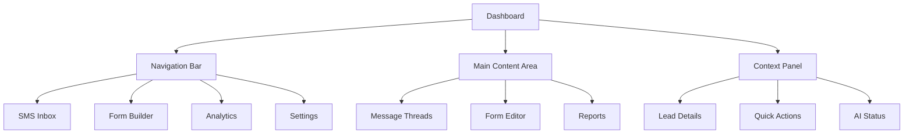

### Key Interface Components

| Component | Purpose | Key Features |
|-----------|----------|--------------|
| SMS Inbox | Message management | - Thread list with status indicators<br>- Real-time updates<br>- AI/Human toggle<br>- Search and filters |
| Form Builder | Lead capture creation | - Drag-drop interface<br>- Field configuration<br>- Preview mode<br>- Embed code generator |
| Analytics Dashboard | Performance tracking | - Conversion metrics<br>- Response rates<br>- AI performance stats<br>- Export options |

## 5.2 DATABASE DESIGN

### Collections Schema

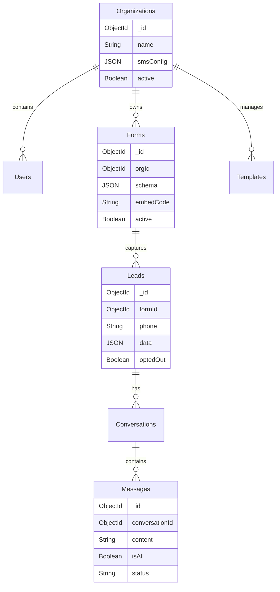

### Indexing Strategy

| Collection | Index | Type | Purpose |
|------------|-------|------|----------|
| Leads | phone | Unique | Fast lookup by phone |
| Messages | conversationId + timestamp | Compound | Thread retrieval |
| Forms | orgId + active | Compound | Active form filtering |
| Conversations | leadId + lastActivity | Compound | Thread sorting |

## 5.3 API DESIGN

### Core Endpoints

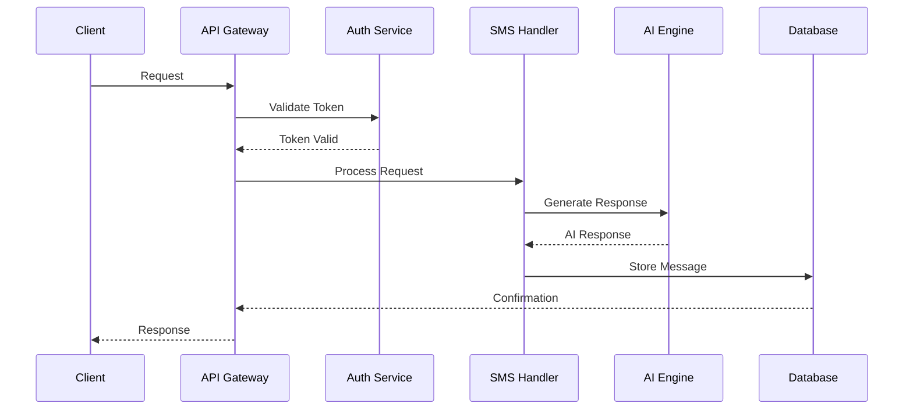

### API Routes

| Endpoint | Method | Purpose | Auth Required |
|----------|---------|---------|---------------|
| /api/forms | POST | Create form | Yes |
| /api/forms/{id} | GET | Retrieve form | Yes |
| /api/leads | POST | Submit lead | No |
| /api/messages | GET | Fetch threads | Yes |
| /api/messages/send | POST | Send message | Yes |
| /api/webhooks/sms | POST | SMS webhook | API Key |

### Message Flow

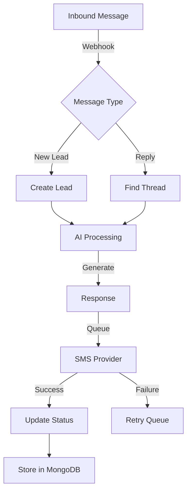

# 6. USER INTERFACE DESIGN

## 6.1 Design System Components

The interface uses Acetunity UI and ShadCN components following these patterns:

| Element | ASCII Symbol | Component |
|---------|--------------|-----------|
| Navigation | [#] | Top menu bar |
| Actions | [+] | Primary action button |
| Settings | [=] | Configuration menu |
| User | [@] | Profile/account |
| Help | [?] | Contextual help |
| Close/Delete | [x] | Destructive actions |
| Alert | [!] | System notifications |
| Info | [i] | Tooltips/details |

## 6.2 Primary Layouts

### 6.2.1 Dashboard Layout

```
+----------------------------------------------------------+
|  [#] Dashboard   [@] Profile   [=] Settings   [?] Help    |
+----------------------------------------------------------+
|                                                           |
|  +----------------+  +--------------------------------+   |
|  |  Navigation    |  |  Active Conversations          |   |
|  |  [#] Inbox     |  |  +----------------------------+   |
|  |  [#] Forms     |  |  | Lead: John Doe             |   |
|  |  [#] Analytics |  |  | Phone: +1 555-0123         |   |
|  |  [#] Templates |  |  | Status: Active [*]         |   |
|  +----------------+  |  +----------------------------+   |
|                     |                                    |
|                     |  +----------------------------+   |
|                     |  | Lead: Jane Smith           |   |
|                     |  | Phone: +1 555-0124         |   |
|                     |  | Status: AI Managing [i]     |   |
|                     |  +----------------------------+   |
|                     +--------------------------------+   |
+----------------------------------------------------------+
```

### 6.2.2 SMS Inbox View

```
+----------------------------------------------------------+
|  [<] Back to Dashboard    Current Thread: John Doe        |
+----------------------------------------------------------+
|                                                           |
|  +----------------+  +--------------------------------+   |
|  |  Threads       |  |  Conversation History          |   |
|  |  [*] John Doe  |  |  +----------------------------+   |
|  |  [ ] Jane Smith|  |  | AI: Hello John! How can...  |   |
|  |  [ ] Bob Wilson|  |  | John: I'm interested in...  |   |
|  |                |  |  | AI: Great! Let me help...   |   |
|  | [+] New Thread |  |  +----------------------------+   |
|  +----------------+  |                                    |
|                     |  [..............................]   |
|                     |  [Send Message]  [Take Over]        |
|                     +--------------------------------+   |
|                                                           |
|  [!] AI Status: Active   [i] Context Panel [=]           |
+----------------------------------------------------------+
```

### 6.2.3 Form Builder Interface

```
+----------------------------------------------------------+
|  Form Builder: Lead Capture Form                          |
+----------------------------------------------------------+
|                                                           |
|  +----------------+  +--------------------------------+   |
|  |  Components    |  |  Form Preview                  |   |
|  |  [^] Text      |  |  +----------------------------+   |
|  |  [^] Email     |  |  | Welcome to Our Service     |   |
|  |  [^] Phone     |  |  |                            |   |
|  |  [^] Select    |  |  | Name: [................]   |   |
|  |                |  |  | Email: [................]   |   |
|  |  Settings:     |  |  | Phone: [................]   |   |
|  |  [ ] Required  |  |  |                            |   |
|  |  [ ] Validate  |  |  | [Submit Form]              |   |
|  +----------------+  +--------------------------------+   |
|                                                           |
|  [Save Form]  [Preview]  [Get Embed Code]                |
+----------------------------------------------------------+
```

## 6.3 Component States

### 6.3.1 Button States
```
Primary:    [Submit]  [Submit!]  [......] 
Secondary:  (Cancel)  (Cancel!)  (.....) 
Disabled:   {Submit}  {Cancel}   {.....}
```

### 6.3.2 Form Elements
```
Text Input:     [...................]
Invalid Input:  [...................] [!] Invalid entry
Dropdown:       [v] Select Option
Checkbox:       [x] Enabled  [ ] Disabled
Radio:          (•) Selected  ( ) Unselected
```

### 6.3.3 Status Indicators
```
Success:  [====] 100% Complete
Warning:  [!] Action Required
Error:    [x] Failed to Send
Loading:  [...] Processing
AI Mode:  [🤖] AI Managing
Human:    [@] Agent Active
```

## 6.4 Responsive Behavior

The interface adapts to different screen sizes following these breakpoints:

```
Desktop (>1024px):
+------------------+------------------+------------------+
|     Column 1     |     Column 2     |     Column 3     |
+------------------+------------------+------------------+

Tablet (768-1024px):
+------------------+------------------+
|     Column 1     |     Column 2     |
+------------------+------------------+

Mobile (<768px):
+------------------+
|     Column 1     |
+------------------+
```

## 6.5 Navigation Flow

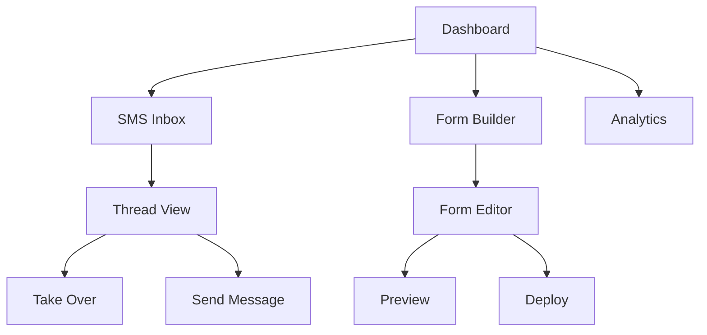

# 7. SECURITY CONSIDERATIONS

## 7.1 AUTHENTICATION AND AUTHORIZATION

### Authentication Flow

```mermaid
sequenceDiagram
    participant User
    participant Frontend
    participant Auth Service
    participant Database
    
    User->>Frontend: Login Request
    Frontend->>Auth Service: Validate Credentials
    Auth Service->>Database: Check User
    Database-->>Auth Service: User Data
    Auth Service->>Auth Service: Generate JWT
    Auth Service-->>Frontend: Return JWT
    Frontend->>User: Login Success
```

### Authorization Levels

| Role | Permissions | Access Scope |
|------|------------|--------------|
| Admin | Full system access | All organizations |
| Organization Admin | Organization management | Single organization |
| Agent | Message management | Assigned conversations |
| Form Manager | Form creation/editing | Organization forms |
| Read Only | View-only access | Organization data |

### Session Management

| Aspect | Implementation |
|--------|----------------|
| Token Type | JWT with refresh tokens |
| Token Expiry | Access: 1 hour, Refresh: 7 days |
| Storage | HttpOnly cookies |
| Renewal | Silent token refresh |
| Invalidation | Server-side blacklist |

## 7.2 DATA SECURITY

### Data Protection Layers

```mermaid
graph TD
    A[Data Entry] -->|TLS 1.3| B[Transport Layer]
    B -->|Input Validation| C[Application Layer]
    C -->|Field Encryption| D[Storage Layer]
    D -->|MongoDB Encryption| E[Database Layer]
    
    F[Security Controls] --> G[Access Logging]
    F --> H[Audit Trail]
    F --> I[Data Masking]
```

### Encryption Standards

| Data Type | Encryption Method | Key Management |
|-----------|------------------|----------------|
| PII Data | AES-256 | AWS KMS |
| Passwords | Bcrypt | Salt per password |
| Messages | AES-256 | Per-organization keys |
| API Keys | SHA-256 HMAC | Secure vault storage |

### Data Classification

| Level | Data Types | Security Measures |
|-------|------------|------------------|
| High | Phone numbers, Messages | Field-level encryption |
| Medium | Form submissions | Collection-level encryption |
| Low | Public form templates | Standard protection |

## 7.3 SECURITY PROTOCOLS

### API Security

```mermaid
graph LR
    A[API Request] -->|Rate Limiting| B[WAF]
    B -->|Input Validation| C[Auth Check]
    C -->|RBAC| D[Resource Access]
    D -->|Response Filtering| E[API Response]
```

### Security Controls

| Control Type | Implementation | Purpose |
|-------------|----------------|----------|
| Rate Limiting | 100 req/min per IP | Prevent abuse |
| Input Sanitization | Server-side validation | Prevent injection |
| CORS | Whitelist domains | Cross-origin protection |
| CSP | Strict policy | XSS prevention |
| Audit Logging | MongoDB change streams | Activity tracking |

### Compliance Requirements

| Requirement | Implementation |
|-------------|----------------|
| GDPR | Data encryption, Right to erasure |
| CCPA | Data access controls, Privacy notices |
| TCPA | SMS opt-out handling |
| SOC 2 | Audit trails, Access controls |

### Security Monitoring

```mermaid
graph TD
    A[Security Events] -->|Real-time| B[Log Collection]
    B -->|Analysis| C[Alert System]
    C -->|Critical| D[Immediate Alert]
    C -->|Warning| E[Daily Report]
    
    F[System Metrics] -->|Continuous| G[Monitoring]
    G -->|Threshold| H[Auto Response]
```

### Incident Response

| Phase | Actions | Responsibility |
|-------|---------|---------------|
| Detection | Log analysis, Alert verification | Security team |
| Containment | Service isolation, Access revocation | DevOps team |
| Eradication | Vulnerability patching, System hardening | Development team |
| Recovery | Service restoration, Data validation | Operations team |
| Review | Incident documentation, Process improvement | Security team |

# 8. INFRASTRUCTURE

## 8.1 DEPLOYMENT ENVIRONMENT

The system will be deployed exclusively on Vercel's cloud platform, following a serverless architecture pattern.

| Environment | Purpose | Configuration |
|-------------|----------|--------------|
| Development | Local development | Vercel CLI with local MongoDB |
| Staging | Pre-production testing | Vercel Preview Deployments |
| Production | Live system | Vercel Production Environment |

### Environment Configuration

```mermaid
flowchart TD
    A[Git Repository] -->|Auto Deploy| B[Vercel Platform]
    B -->|Preview| C[Staging Environment]
    B -->|Production| D[Production Environment]
    
    C -->|Connection| E[(MongoDB Atlas Staging)]
    D -->|Connection| F[(MongoDB Atlas Production)]
    
    G[Environment Variables] -->|Config| C
    G -->|Config| D
```

## 8.2 CLOUD SERVICES

| Service | Provider | Purpose | Justification |
|---------|----------|---------|---------------|
| Hosting | Vercel | Application deployment | Optimized for Next.js, simplified deployment |
| Database | MongoDB Atlas | Data persistence | Managed service, automatic scaling |
| CDN | Vercel Edge Network | Static asset delivery | Built-in with Vercel |
| DNS | Vercel DNS | Domain management | Integrated with deployment |

## 8.3 CONTAINERIZATION

Not applicable for this implementation as Vercel provides serverless deployment without container requirements.

## 8.4 ORCHESTRATION

Not applicable as the system utilizes Vercel's managed serverless infrastructure.

## 8.5 CI/CD PIPELINE

```mermaid
flowchart LR
    A[Developer Push] -->|Trigger| B[GitHub Actions]
    B -->|Run Tests| C{Tests Pass?}
    C -->|Yes| D[Vercel Build]
    C -->|No| E[Notify Developer]
    D -->|Success| F[Preview Deploy]
    F -->|Approved| G[Production Deploy]
    
    H[Quality Gates] -->|Enforce| B
    H -->|Validate| D
```

### Pipeline Stages

| Stage | Actions | Tools |
|-------|---------|-------|
| Code Validation | Lint, Type Check | ESLint, TypeScript |
| Testing | Unit, Integration Tests | Jest, Testing Library |
| Build | Next.js Build | Vercel Build System |
| Preview | Deploy to Preview URL | Vercel Preview Deployments |
| Production | Deploy to Production | Vercel Production Deploy |

### Deployment Process

```mermaid
sequenceDiagram
    participant Dev as Developer
    participant Git as GitHub
    participant CI as GitHub Actions
    participant Vercel as Vercel Platform
    participant DB as MongoDB Atlas

    Dev->>Git: Push Code
    Git->>CI: Trigger Workflow
    CI->>CI: Run Tests
    CI->>Vercel: Trigger Build
    Vercel->>Vercel: Build Next.js App
    Vercel->>DB: Configure Connection
    Vercel->>Vercel: Deploy
    Vercel-->>Dev: Deploy Status
```

### Environment Variables Management

| Category | Storage | Access |
|----------|---------|--------|
| Development | .env.local | Local only |
| Staging | Vercel Dashboard | Preview deployments |
| Production | Vercel Dashboard | Production only |
| Secrets | Vercel Dashboard | Encrypted storage |

This infrastructure setup prioritizes simplicity and ease of deployment while maintaining scalability and security through Vercel's platform capabilities and MongoDB Atlas's managed database service.

# 8. APPENDICES

## 8.1 ADDITIONAL TECHNICAL INFORMATION

### Development Environment Setup

```mermaid
graph TD
    A[Local Development] -->|Prerequisites| B[Node.js 18.x LTS]
    A -->|Package Manager| C[npm/yarn]
    A -->|IDE| D[VS Code]
    A -->|Version Control| E[Git]
    
    F[Environment Variables] -->|Development| G[.env.local]
    F -->|Production| H[Vercel Dashboard]
    
    I[Database Setup] -->|Local| J[MongoDB Community]
    I -->|Production| K[MongoDB Atlas]
```

### Error Handling Strategy

| Error Type | Handling Approach | Recovery Method |
|------------|------------------|-----------------|
| Form Validation | Client-side validation with zod | Immediate user feedback |
| SMS Delivery | Exponential backoff retry | Queue for retry up to 3 times |
| AI Processing | Fallback to templates | Route to human agent |
| Database Connection | Connection pool management | Automatic reconnection |
| API Rate Limits | Token bucket algorithm | Request queuing |

## 8.2 GLOSSARY

| Term | Definition |
|------|------------|
| Provider-agnostic | System designed to work with multiple SMS providers without dependency |
| Lead Capture | Process of collecting potential customer information via web forms |
| Thread | Complete sequence of messages between system and lead |
| Handoff | Process of transitioning conversation from AI to human agent |
| Cold Storage | Long-term storage for infrequently accessed data |
| Webhook | HTTP callback triggered by system events |
| Rate Limiting | Controlling frequency of API requests |
| Exponential Backoff | Progressive delay between retry attempts |

## 8.3 ACRONYMS

| Acronym | Full Form |
|---------|-----------|
| API | Application Programming Interface |
| BSON | Binary JSON |
| CCPA | California Consumer Privacy Act |
| GDPR | General Data Protection Regulation |
| JWT | JSON Web Token |
| PII | Personally Identifiable Information |
| RBAC | Role-Based Access Control |
| REST | Representational State Transfer |
| RPO | Recovery Point Objective |
| RTO | Recovery Time Objective |
| SMS | Short Message Service |
| SSR | Server-Side Rendering |
| TCPA | Telephone Consumer Protection Act |
| TLS | Transport Layer Security |
| UI | User Interface |
| UUID | Universally Unique Identifier |
| WCAG | Web Content Accessibility Guidelines |
| WSS | WebSocket Secure |

## 8.4 DEPLOYMENT CHECKLIST

```mermaid
graph LR
    A[Pre-deployment] -->|Environment Setup| B[Configuration]
    B -->|Database| C[MongoDB Atlas Setup]
    B -->|SMS Provider| D[Provider Integration]
    
    E[Deployment] -->|Build| F[Next.js Build]
    F -->|Deploy| G[Vercel Platform]
    
    H[Post-deployment] -->|Verify| I[Health Checks]
    H -->|Monitor| J[Performance Metrics]
    H -->|Test| K[Integration Tests]
```

| Phase | Task | Verification |
|-------|------|-------------|
| Pre-deployment | Environment variables setup | Configuration check |
| | Database connection | Connection test |
| | SMS provider configuration | API test |
| Deployment | Build application | Build success |
| | Deploy to Vercel | Deployment status |
| | SSL certificate | HTTPS verification |
| Post-deployment | API endpoints | Health check |
| | Database connectivity | Query test |
| | SMS functionality | Test message |
| | Monitoring setup | Dashboard active |