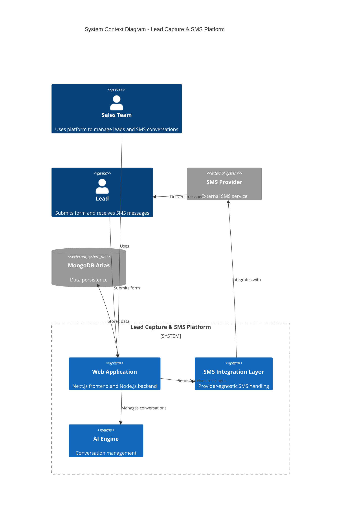
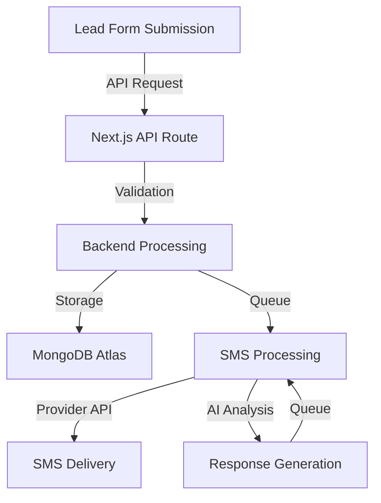
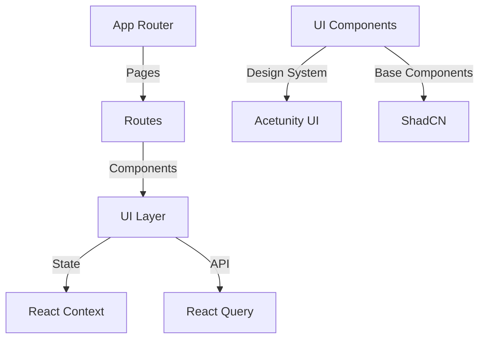
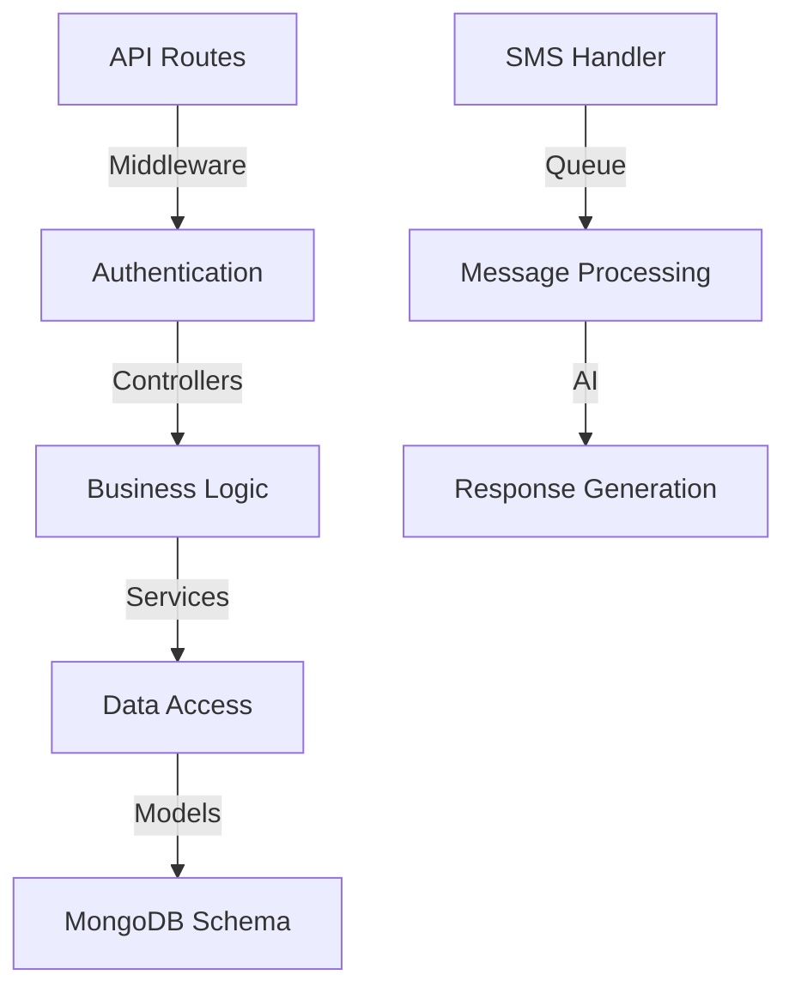
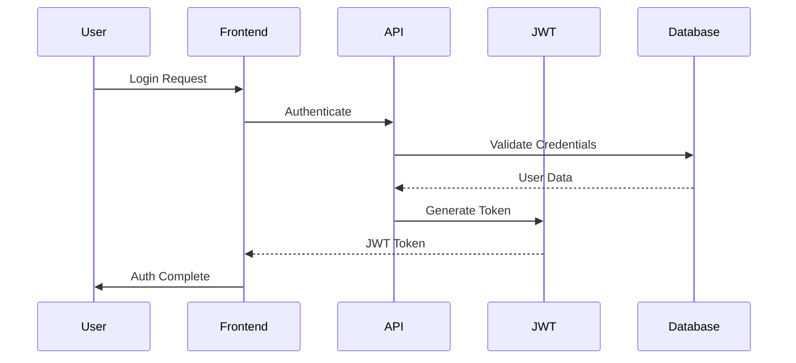
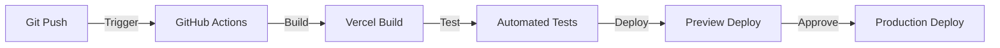

# AI-Driven Lead Capture & SMS Lead Nurturing Platform Architecture

Version: 1.0.0  
Last Updated: 2024-01-20  
Review Cycle: Quarterly

## Table of Contents

1. [System Overview](#1-system-overview)
2. [Infrastructure Components](#2-infrastructure-components)
3. [Application Architecture](#3-application-architecture)
4. [Security Architecture](#4-security-architecture)
5. [Deployment Architecture](#5-deployment-architecture)

## 1. System Overview

### 1.1 High-Level Architecture

### 1.2 Component Interactions

The system is built on a modular architecture with the following key interactions:

- **Frontend to Backend**: REST API communication via Next.js API routes
- **Backend to Database**: Direct MongoDB connection using native driver
- **SMS Integration**: Provider-agnostic abstraction layer
- **AI Processing**: Asynchronous message processing pipeline
- **Real-time Updates**: WebSocket connections for live message updates

### 1.3 Data Flow Patterns

## 2. Infrastructure Components

### 2.1 Vercel Deployment

Primary deployment platform configuration:
- Production environment: Vercel
- Edge network utilization
- Automatic scaling
- Zero-downtime deployments
- Built-in monitoring and analytics

### 2.2 MongoDB Atlas Setup

Database infrastructure:
- Cluster configuration: M10 or higher
- Automatic scaling enabled
- Daily backups
- Geographic replication
- Connection pooling

### 2.3 Optional Redis Caching

Performance optimization layer:
- Session management
- Rate limiting
- Temporary data caching
- Real-time message queues

### 2.4 Monitoring and Logging

Comprehensive observability stack:
- Vercel Analytics for performance metrics
- Custom monitoring for business metrics
- Error tracking and alerting
- Audit logging for security events

## 3. Application Architecture

### 3.1 Frontend Structure (Next.js 14.x)

### 3.2 Backend Organization (Node.js)

## 4. Security Architecture

### 4.1 Authentication Flow

### 4.2 Data Protection

- End-to-end encryption for sensitive data
- Field-level encryption for PII
- At-rest encryption for database
- TLS 1.3 for all communications

## 5. Deployment Architecture

### 5.1 CI/CD Pipeline

### 5.2 Environment Configuration

- Development: Local environment with .env.local
- Staging: Preview deployments
- Production: Vercel production environment
- Secrets: Vercel Environment Variables

### 5.3 Scaling Strategy

- Automatic scaling via Vercel
- Database scaling through MongoDB Atlas
- Cache layer scaling with Redis (optional)
- Load balancing at edge locations

## Stakeholders

- Development Team: Implementation and maintenance
- DevOps Team: Infrastructure and deployment
- Security Team: Security reviews and compliance

## References

- Infrastructure Configuration: infrastructure/terraform/main.tf
- Backend Application: src/backend/src/app.ts
- Frontend Application: src/web/src/app/layout.tsx

---
Document maintained by the Platform Architecture Team