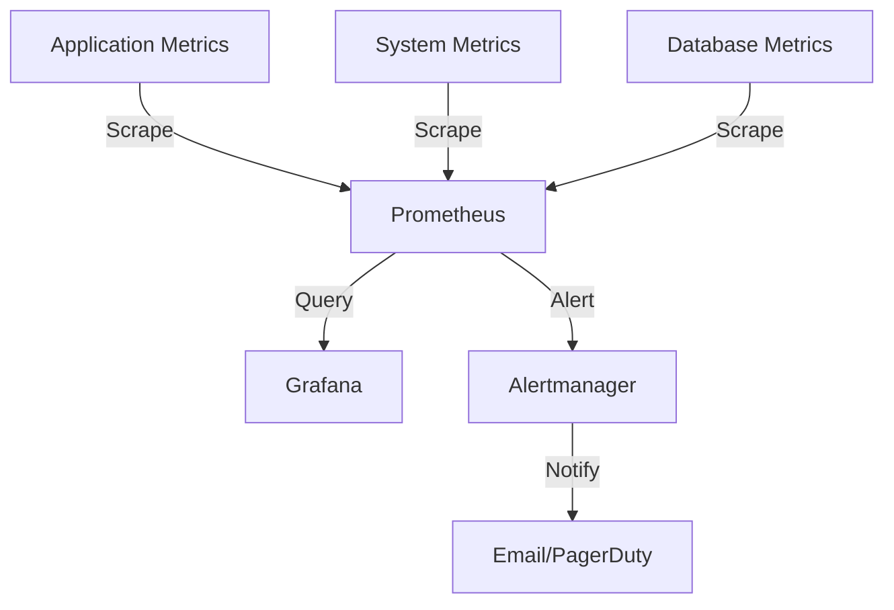

# Monitoring Documentation
Version: 1.0.0
Last Updated: 2024

## 1. Overview

### 1.1 Monitoring Architecture
The Lead Capture & SMS Platform implements a comprehensive monitoring stack built on industry-standard tools:

- Prometheus (v2.45.0) - Metrics collection and storage
- Grafana (v9.5.0) - Metrics visualization and dashboarding
- Alertmanager (v0.25.0) - Alert management and notification routing

### 1.2 Key Components


### 1.3 Integration Points
- Application instrumentation via Prometheus client libraries
- MongoDB metrics via mongodb_exporter
- Redis metrics via redis_exporter
- System-level metrics via node_exporter

## 2. Metrics Collection

### 2.1 Core Performance Metrics

| Metric | SLA | Alert Threshold | Collection Method |
|--------|-----|-----------------|-------------------|
| Message Processing Time | < 5s | > 3s (warning), > 5s (critical) | Histogram |
| Form Submission Latency | < 2s | > 1s (warning), > 2s (critical) | Histogram |
| System Uptime | 99.9% | < 99.95% (warning), < 99.9% (critical) | Gauge |

### 2.2 Custom Metrics

```prometheus
# Message Processing Duration
histogram_quantile(0.95, rate(message_processing_duration_seconds_bucket[5m]))

# Form Submission Latency
histogram_quantile(0.95, rate(form_submission_duration_seconds_bucket[5m]))

# System Uptime
avg_over_time(up{job="lead-capture-sms-platform"}[30d]) * 100
```

### 2.3 Retention and Storage
- Metrics retention: 15 days
- Storage limit: 10GB
- WAL compression enabled
- High-availability configuration supported

## 3. Visualization

### 3.1 System Dashboards

#### Performance Overview
- Message processing metrics
- Form submission latency
- System resource utilization
- Queue metrics
- Database connections

#### Key Performance Indicators
- 95th percentile response times
- Success rates
- Error rates
- Resource utilization trends

### 3.2 Business Metrics Dashboard
- Lead capture rates
- Conversion metrics
- AI response effectiveness
- SMS delivery success rates

## 4. Alerting

### 4.1 Alert Severity Levels

| Level | Response Time | Notification Channels |
|-------|--------------|---------------------|
| Critical | Immediate | Email + PagerDuty |
| Warning | Within 1 hour | Email |
| Info | Daily digest | Email |

### 4.2 Alert Rules

#### Critical Alerts
```yaml
- alert: message_processing_latency
  expr: rate(message_processing_duration_seconds_sum[5m]) / 
        rate(message_processing_duration_seconds_count[5m]) > 5
  for: 5m
  labels:
    severity: critical
    service: sms
```

#### Warning Alerts
```yaml
- alert: high_memory_usage
  expr: process_resident_memory_bytes / container_memory_limit_bytes > 0.85
  for: 10m
  labels:
    severity: warning
    service: system
```

### 4.3 Notification Routing
- Critical alerts: Immediate notification to on-call team via PagerDuty
- Warning alerts: Email notification with 2-hour repeat interval
- Resolution notifications: Sent for all alert levels

## 5. Performance Thresholds

### 5.1 Service Level Objectives (SLOs)

| Metric | Target | Measurement Window |
|--------|--------|-------------------|
| Message Processing | 99% < 5s | 30-day rolling window |
| Form Submission | 99% < 2s | 30-day rolling window |
| System Availability | 99.9% | 30-day rolling window |

### 5.2 Resource Utilization Thresholds

| Resource | Warning | Critical | Action |
|----------|---------|----------|--------|
| CPU | 85% | 95% | Auto-scaling trigger |
| Memory | 85% | 95% | Alert and investigate |
| Queue Size | 1000 | 5000 | Scale processing capacity |

### 5.3 Scaling Triggers
- CPU utilization > 85% for 5 minutes
- Message queue size > 1000
- Processing latency > 3s for 5 minutes

## 6. Compliance and Security Monitoring

### 6.1 Audit Trail
- All system access logged
- Configuration changes tracked
- Alert response documentation

### 6.2 Security Metrics
- Authentication failures
- Rate limiting violations
- Suspicious activity patterns

### 6.3 Compliance Reporting
- Uptime reporting for SLA compliance
- Performance metrics for SLO validation
- Security incident tracking

## 7. Maintenance and Operations

### 7.1 Monitoring System Maintenance
- Regular backup of Prometheus data
- Grafana dashboard version control
- Alert rule review and updates

### 7.2 Incident Response
1. Alert triggered via defined thresholds
2. On-call team notified through appropriate channels
3. Incident investigation and resolution
4. Post-incident review and documentation

### 7.3 Capacity Planning
- Monitor resource utilization trends
- Predict scaling requirements
- Regular performance review meetings

## 8. References

- [Prometheus Documentation](https://prometheus.io/docs/introduction/overview/) v2.45.0
- [Grafana Documentation](https://grafana.com/docs/) v9.5.0
- [Alertmanager Documentation](https://prometheus.io/docs/alerting/latest/alertmanager/) v0.25.0