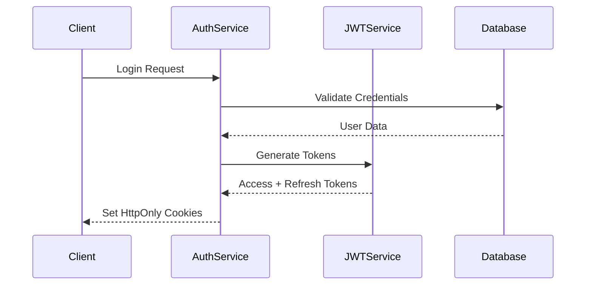
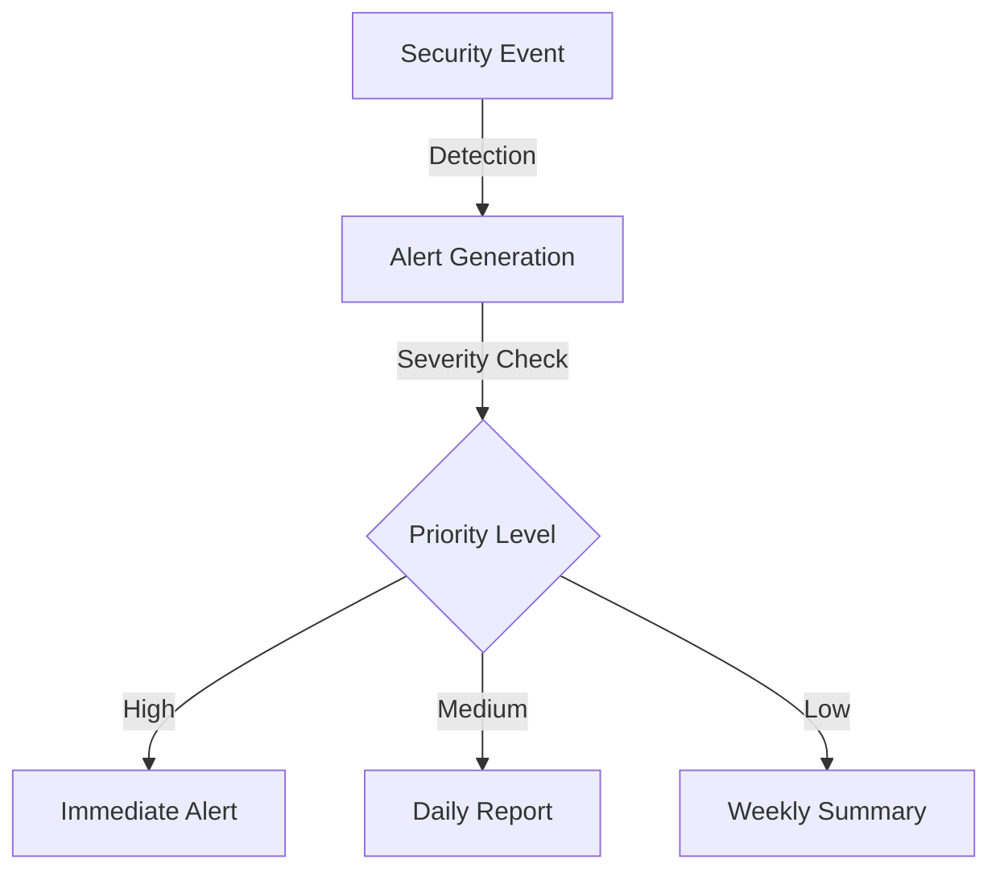

# Security Documentation
Version: 1.0.0
Last Updated: 2024

## Table of Contents
1. [Authentication System](#1-authentication-system)
2. [Authorization Framework](#2-authorization-framework)
3. [Data Protection](#3-data-protection)
4. [API Security](#4-api-security)
5. [Monitoring and Auditing](#5-monitoring-and-auditing)
6. [Compliance](#6-compliance)
7. [Incident Response](#7-incident-response)

## 1. Authentication System

### 1.1 JWT-Based Authentication Flow

The system implements a secure JWT-based authentication system with the following characteristics:



### 1.2 Token Management

| Token Type | Expiry | Storage | Purpose |
|------------|--------|---------|----------|
| Access Token | 1 hour | HttpOnly Cookie | API Authentication |
| Refresh Token | 7 days | HttpOnly Cookie | Token Renewal |

### 1.3 Token Validation Process
- Access tokens are validated on every API request
- Refresh tokens enable silent token renewal
- Invalid tokens trigger automatic logout
- Concurrent sessions are tracked and limited

## 2. Authorization Framework

### 2.1 Role-Based Access Control (RBAC)

| Role | Scope | Permissions |
|------|-------|-------------|
| Admin | Global | Full system access, user management |
| Organization Admin | Organization | Org settings, user management |
| Agent | Assigned Conversations | Message management, lead interaction |
| Form Manager | Organization Forms | Form CRUD operations |
| Read Only | Organization Data | View-only access |

### 2.2 Permission Implementation
```typescript
// Permission check example
async function checkPermission(user: User, resource: string, action: string): Promise<boolean> {
    const role = await getRolePermissions(user.roleId);
    return role.permissions.includes(`${resource}:${action}`);
}
```

## 3. Data Protection

### 3.1 Encryption Standards

| Data Type | Encryption Method | Key Management |
|-----------|------------------|----------------|
| PII Data | AES-256-GCM | AWS KMS |
| Passwords | Bcrypt (12 rounds) | Per-password salt |
| Messages | AES-256-GCM | Per-organization keys |

### 3.2 Data Classification

| Sensitivity | Data Types | Protection Measures |
|-------------|------------|-------------------|
| High | Phone numbers, Passwords | Field-level encryption |
| Medium | Messages, Lead data | Collection-level encryption |
| Low | Public form templates | Standard protection |

## 4. API Security

### 4.1 Rate Limiting
```typescript
// Rate limit configuration
const rateLimitConfig = {
    windowMs: 60 * 1000, // 1 minute
    max: 100, // limit each IP to 100 requests per windowMs
    message: 'Too many requests, please try again later'
};
```

### 4.2 Input Validation
- Server-side validation using Zod
- Sanitization of all user inputs
- Type checking and schema validation
- Prevention of SQL injection and XSS

### 4.3 CORS Policy
```typescript
const corsOptions = {
    origin: process.env.ALLOWED_ORIGINS.split(','),
    credentials: true,
    methods: ['GET', 'POST', 'PUT', 'DELETE', 'OPTIONS'],
    allowedHeaders: ['Content-Type', 'Authorization']
};
```

## 5. Monitoring and Auditing

### 5.1 Security Event Logging
- All authentication attempts
- Authorization failures
- Data access patterns
- System configuration changes

### 5.2 Audit Trail
```typescript
interface AuditLog {
    timestamp: Date;
    userId: string;
    action: string;
    resource: string;
    details: object;
    ip: string;
}
```

## 6. Compliance

### 6.1 GDPR Compliance
- Right to erasure implementation
- Data portability support
- Privacy policy enforcement
- Consent management

### 6.2 CCPA Requirements
- Data access controls
- Privacy notices
- Opt-out mechanisms
- Data deletion processes

### 6.3 TCPA Guidelines
- SMS opt-out handling
- Consent verification
- Message frequency limits
- Time window restrictions

## 7. Incident Response

### 7.1 Response Phases

| Phase | Team | Actions |
|-------|------|---------|
| Detection | Security | Log analysis, Alert verification |
| Containment | DevOps | Service isolation, Access revocation |
| Recovery | Operations | Service restoration, Data validation |

### 7.2 Alert System


### 7.3 Recovery Procedures
1. Identify and isolate affected systems
2. Revoke compromised credentials
3. Restore from secure backups
4. Validate data integrity
5. Resume normal operations
6. Document incident and update procedures

## Security Contacts

For security-related issues or concerns:
- Security Team: security@company.com
- Emergency Hotline: +1 (555) 123-4567
- Bug Bounty Program: https://bugbounty.company.com

---

**Note**: This document should be reviewed and updated quarterly or when significant system changes occur.