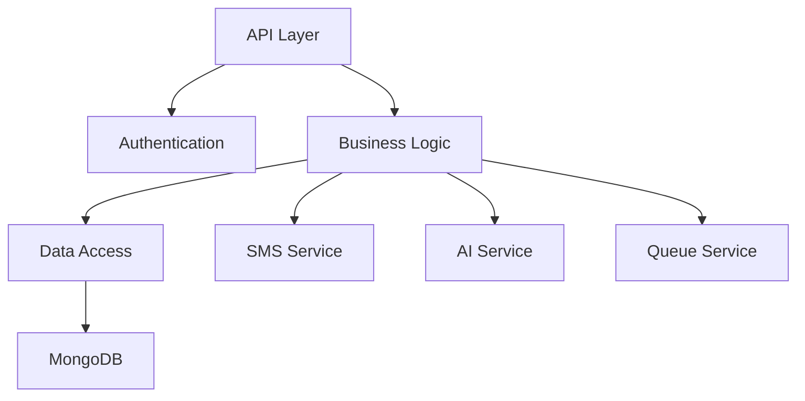

# AI-Driven Lead Capture & SMS Platform - Backend Service

## Table of Contents
- [Project Overview](#project-overview)
- [Prerequisites](#prerequisites)
- [Installation](#installation)
- [Development](#development)
- [Architecture](#architecture)
- [Security](#security)
- [Deployment](#deployment)
- [Testing](#testing)
- [API Documentation](#api-documentation)
- [Contributing](#contributing)
- [Troubleshooting](#troubleshooting)

## Project Overview

The backend service powers the AI-Driven Lead Capture & SMS Lead Nurturing Platform, providing robust APIs and services for lead management, SMS communication, and AI-powered conversation handling.

### Key Features
- Provider-agnostic SMS integration
- AI-powered conversation management
- Real-time messaging capabilities
- Secure authentication and authorization
- Scalable MongoDB data persistence
- Vercel-optimized deployment

### Tech Stack
- Node.js 18.x LTS
- TypeScript 5.0+
- MongoDB 5.0+
- Redis (optional)
- Express.js
- JWT Authentication

## Prerequisites

### Required Software
- Node.js >= 18.x LTS
- MongoDB >= 5.0
- Redis (optional for queue management)
- Git
- VS Code (recommended)

### API Credentials
- SMS Provider API credentials
- MongoDB Atlas account
- Vercel account

## Installation

1. Clone the repository:
```bash
git clone <repository-url>
cd src/backend
```

2. Install dependencies:
```bash
npm install
```

3. Configure environment variables:
```bash
cp .env.example .env.local
```

4. Set up environment variables:
```env
# Server
PORT=3000
NODE_ENV=development

# Database
MONGODB_URI=mongodb://localhost:27017/lead-capture
MONGODB_DB_NAME=lead-capture

# Authentication
JWT_SECRET=your-secret-key
JWT_EXPIRY=1h
REFRESH_TOKEN_EXPIRY=7d

# SMS Provider
SMS_PROVIDER_API_KEY=your-api-key
SMS_PROVIDER_SECRET=your-secret

# AI Service
AI_SERVICE_API_KEY=your-ai-api-key

# Redis (Optional)
REDIS_URL=redis://localhost:6379
```

5. Initialize database:
```bash
npm run db:setup
```

## Development

### Available Scripts
```bash
npm run dev          # Start development server
npm run build        # Build production bundle
npm run start        # Start production server
npm run test         # Run tests
npm run lint         # Run ESLint
npm run format       # Run Prettier
npm run type-check   # Run TypeScript compiler check
```

### Project Structure
```
src/backend/
├── src/
│   ├── api/            # API routes and controllers
│   ├── config/         # Configuration files
│   ├── models/         # MongoDB models
│   ├── services/       # Business logic
│   ├── utils/          # Utility functions
│   └── types/          # TypeScript type definitions
├── tests/              # Test files
├── scripts/            # Build and deployment scripts
└── docs/              # Additional documentation
```

### Code Style
- ESLint configuration with Airbnb preset
- Prettier for code formatting
- TypeScript strict mode enabled

## Architecture

### System Components


### Database Schema
Refer to MongoDB models for detailed schema definitions:
- Organizations
- Users
- Forms
- Leads
- Conversations
- Messages

## Security

### Authentication
- JWT-based authentication
- Refresh token rotation
- Role-based access control (RBAC)

### Data Protection
- Field-level encryption for PII
- HTTPS/TLS for all communications
- Input validation and sanitization
- Rate limiting and request throttling

## Deployment

### Vercel Deployment
1. Configure Vercel project:
```bash
vercel link
```

2. Set up environment variables in Vercel dashboard

3. Deploy:
```bash
vercel --prod
```

### Monitoring
- Vercel Analytics integration
- Error tracking with Sentry
- Custom logging implementation
- Health check endpoints

## Testing

### Test Types
- Unit tests (Jest)
- Integration tests
- API tests
- Performance tests

### Running Tests
```bash
npm run test              # Run all tests
npm run test:unit        # Run unit tests
npm run test:integration # Run integration tests
npm run test:coverage    # Generate coverage report
```

## API Documentation

### Authentication
```
POST /api/auth/login
POST /api/auth/refresh
POST /api/auth/logout
```

### Forms
```
GET /api/forms
POST /api/forms
GET /api/forms/:id
PUT /api/forms/:id
DELETE /api/forms/:id
```

### Messages
```
GET /api/messages
POST /api/messages/send
GET /api/messages/:id
```

### Webhooks
```
POST /api/webhooks/sms
```

## Contributing

### Pull Request Process
1. Create feature branch from `develop`
2. Implement changes following style guide
3. Add/update tests
4. Update documentation
5. Submit PR for review

### Commit Guidelines
Follow conventional commits specification:
```
feat: add new feature
fix: bug fix
docs: documentation updates
test: add/update tests
refactor: code refactoring
```

## Troubleshooting

### Common Issues
1. Database Connection
```bash
# Check MongoDB connection
npm run db:check
```

2. SMS Provider Integration
```bash
# Verify SMS provider credentials
npm run check:sms-provider
```

3. Environment Variables
```bash
# Validate environment configuration
npm run check:env
```

### Support
- GitHub Issues for bug reports
- Technical documentation in `/docs`
- Development team contact information

For additional information, refer to the technical specification document and related configuration files.